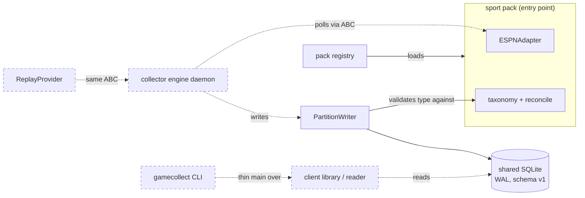
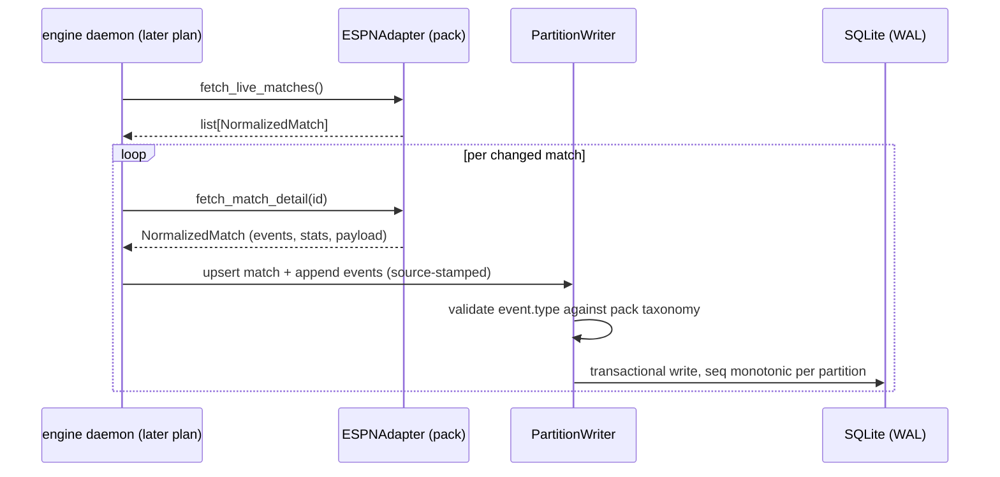

# Task: Collector foundation — scaffold, schema v1, sport-pack SDK, football pack

**Status**: Not Started
**Component**: collector
**Assigned to**: Claude
**Priority**: High
**Branch**: feature/collector-scaffold
**Created**: 2026-07-02
**Completed**:

## Objective

Stand up the gamealerts-collector project per `docs/DESIGN.md`: package scaffold, the versioned generic SQLite schema (v1), the sport-pack SDK, and the first pack (football/FIFA WC2026) ported from gamealerts. After this plan, a football pack can normalize live ESPN data into the shared schema; interfaces (engine daemon, CLI, replay) follow in the sibling plan `20260702-feature-collector-interfaces.md`.

## Context

gamealerts (github.com/vr000m/gamealerts) is being rearchitected into planes; this repo is the data plane, extracted greenfield (see `docs/DESIGN.md`, the authoritative contract — decisions there are not re-litigated here). The existing gamealerts collector is football/WC2026-hardcoded: event taxonomy enums in `data/provider.py`, ESPN `soccer/fifa.world` endpoints in `data/espn.py`, football-shaped schema columns. This plan generalizes those into a core + pack split. gamealerts keeps its in-tree collector untouched until this project stabilizes and reaches PyPI (never consumed via a `[tool.uv.sources]` local path — that bakes absolute paths into `uv.lock` and breaks CI).

Reference code to port lives at `/Users/vr000m/Code/vr000m/gamealerts/backend/gamealerts/` — all "port" tasks below name files there.

## Requirements

- Python >= 3.11, `hatchling` build, `src/` layout, `uv`-managed; runtime dependencies: **stdlib only** (sqlite3, urllib, argparse, json, importlib.metadata) — the ESPN adapter already defaults to stdlib urllib with an injectable `http_get` (espn.py `__init__`); dev deps `pytest>=8.0`, `ruff>=0.4`.
- Schema v1 per DESIGN.md §3–4: generic core tables + JSON payload columns + `source` partition key; `schema_meta` version table; core-library-owned pragmas (WAL, busy_timeout, foreign_keys — port the pattern from gamealerts `store/db.py:45-48`); daemons/consumers refuse a newer major schema version.
- Partition-per-writer: every row a collector writes carries its `source` (tournament/provider instance); the write API scopes all writes to the connection's declared source; per-match `seq` monotonic within its partition.
- Sport-pack SDK per DESIGN.md §5: entry-point group `gamecollect.packs`; a pack supplies provider factory, event taxonomy declaration, prompt fragments, preference schema, display metadata, compaction boundaries.
- Football pack: port `MatchDataProvider` ABC + `Normalized*` dataclasses (provider.py:378-388 and the dataclasses/enums in the same file), `ESPNAdapter` (espn.py), team reconciliation (reconcile.py), and the JSON fixtures under `data/fixtures/`. Behavior parity with gamealerts is the port's acceptance bar.
- The `commentary` table does NOT exist in this schema (DESIGN.md §3) — prose belongs to consuming apps.
- No imports from gamealerts anywhere; this project is standalone.

## Review Focus

- Schema-version semantics: exactly when does a daemon refuse to start (newer major only? equal major/newer minor allowed?) — the plan pins refuse-on-newer-major; verify the migration runner enforces precisely that.
- Partition-per-writer enforcement: is it structurally enforced (write API scoped by construction) or convention? Convention-only is a finding.
- Taxonomy generalization: core stores `events.type` as pack-declared strings — verify the football pack's declared taxonomy is exactly the `EventType` enum value set from gamealerts `data/provider.py` (no silently dropped or renamed types), and that `_normalize_key_event`'s 0–2-event expansion (yellow-red split) survives the port.
- The generic `entities` table replaces football `rosters`; verify the folded-name lookup capability (`player_name_folded`, `canonical_player_name`) survives generalization — consuming voice tools depend on fold-based matching.
- Standalone-ness: `rg 'from gamealerts|import gamealerts' src/` must be empty.

## Implementation Checklist

### Phase 1: Project scaffold

**Impl files:** `pyproject.toml, src/gamecollect/__init__.py, .github/workflows/ci.yml, ruff.toml, .gitignore`
**Test files:** `tests/test_scaffold.py`
**Test command:** `uv run pytest tests/test_scaffold.py -q`
**Validation cmd:** `uv run ruff format --check src tests && uv run ruff check src tests`

- `pyproject.toml`: hatchling, `requires-python >= 3.11`, no runtime deps, dev group (pytest, ruff), console script `gamecollect = "gamecollect.cli:main"` (stub until the interfaces plan), entry-point group declaration for `gamecollect.packs`.
- `src/gamecollect/` package skeleton with `__init__.py` exposing `__version__`.
- CI: GitHub Actions — `uv sync --frozen`, ruff format+check, pytest. Single job, ubuntu + macos matrix not needed yet.
- `tests/test_scaffold.py`: package imports, version present, entry-point group queryable via `importlib.metadata`.

### Phase 2: Schema v1 + core DB layer

**Impl files:** `src/gamecollect/db/schema.sql, src/gamecollect/db/connection.py, src/gamecollect/db/migrations.py, src/gamecollect/db/writer.py, src/gamecollect/db/reader.py`
**Test files:** `tests/test_schema.py, tests/test_writer_partition.py, tests/test_migrations.py`
**Test command:** `uv run pytest tests/test_schema.py tests/test_writer_partition.py tests/test_migrations.py -q`

- `schema.sql` v1 generic core: `schema_meta` (schema major/minor, applied_at); `matches` (PK `match_id`, `source` NOT NULL, kickoff_utc, home/away entity refs, status, minute/period, score_home/away, display_clock, `payload` JSON, updated_at); `events` (PK (match_id, seq), minute/period, `type` TEXT NOT NULL, importance, actor/target entity refs, detail, `payload` JSON); `entities` (PK (source, entity_id), kind TEXT — team|player|driver, display_name, name_folded, parent_entity, `payload` JSON); `standings` (PK (source, group_key, entity_id), points/rank + `payload` JSON); `provider_match_map` ported as-is.
- `connection.py`: `connect(path)` sets `journal_mode=WAL`, `busy_timeout=5000`, `foreign_keys=ON` (port `store/db.py:45-48` pattern); applies schema when missing; refuses to open when `schema_meta` major > library major.
- `migrations.py`: ordered additive migrations keyed by (major, minor); the rosters-folded back-add in gamealerts `_apply_schema` is the pattern to generalize.
- `writer.py`: `PartitionWriter(conn, source)` — all inserts/upserts stamp `source`; raises on any attempt to write a row whose `source` differs; allocates per-match `seq` monotonically within the partition.
- `reader.py`: untyped low-level reads used by the client library later (`list_matches`, `get_state`, `get_events_since`, `get_standings`, entity lookups by folded name).
- Tests: pragma values asserted on a fresh connection; two writers on one file (different sources) interleave safely under WAL; cross-partition write raises; newer-major refusal; migration idempotency.

### Phase 3: Sport-pack SDK

**Impl files:** `src/gamecollect/packs/__init__.py, src/gamecollect/packs/spec.py, src/gamecollect/packs/registry.py, src/gamecollect/provider.py`
**Test files:** `tests/test_pack_registry.py, tests/test_provider_abc.py`
**Test command:** `uv run pytest tests/test_pack_registry.py tests/test_provider_abc.py -q`

- `provider.py`: port `MatchDataProvider` ABC (`fetch_live_matches`, `fetch_match_detail`) + `Normalized*` dataclasses from gamealerts `data/provider.py`, generalized: `event_type` becomes `str` (pack-validated), `MatchStatus` stays a core enum, football-specific `NormalizedStats`/`NormalizedLineup*` move to the football pack, `NormalizedMatch` gains `payload: dict` for sport extras. Port `ProviderError`/`ShapeDriftError`/`ProviderUnavailableError` unchanged.
- `spec.py`: `SportPack` dataclass — `name`, `sport`, `provider_factory`, `taxonomy: dict[str, EventTypeDecl]` (display name, importance default), `prompt_fragments: dict[str, str]`, `preference_schema: dict` (JSON-schema-shaped), `display_metadata: dict`, `compaction_boundaries: list[str]`.
- `registry.py`: discover packs via `importlib.metadata.entry_points(group="gamecollect.packs")`; validate a loaded pack (taxonomy non-empty, provider factory returns a `MatchDataProvider`).
- Taxonomy validation hook: `PartitionWriter` rejects an event `type` not in the active pack's taxonomy (explicit, loud — shape drift shows up at write time, mirroring gamealerts' `ShapeDriftError` philosophy).

### Phase 4: Football/WC2026 pack

**Impl files:** `src/gamecollect_football/__init__.py, src/gamecollect_football/pack.py, src/gamecollect_football/espn.py, src/gamecollect_football/reconcile.py, src/gamecollect_football/taxonomy.py, src/gamecollect_football/fixtures/*.json`
**Test files:** `tests/football/test_espn_adapter.py, tests/football/test_reconcile.py, tests/football/test_taxonomy_parity.py`
**Test command:** `uv run pytest tests/football -q`
**Validation cmd:** `uv run python -c "from gamecollect.packs.registry import load_pack; p = load_pack('football-wc2026'); print(p.name, len(p.taxonomy))"`

- Ship in-repo as a second package (`gamecollect_football`) with its own entry point, proving the SDK from the outside; same wheel for now.
- `taxonomy.py`: the `EventType` value set + `EventImportance` defaults from gamealerts `data/provider.py`, as data.
- `espn.py`: port `ESPNAdapter` and its private helpers (`_normalize_key_event` incl. yellow-red split, `_normalize_roster`, `_normalize_team_stats`, `_classify_goal_slug`, `_MAX_RESPONSE_BYTES` guard); tournament (`fifa.world`) becomes a constructor parameter with WC2026 default — the Champions-League-is-config promise.
- `reconcile.py`: port `TEAM_ALIASES`, `canonical_display_name`, `canonical_team_name`, `canonical_player_name`, `resolve_canonical_match_id`, `register_unreconciled_match` (DAO calls rewritten against `writer.py`/`reader.py`).
- Copy `data/fixtures/qatar_canada_760440.summary.json` (+ worldcup schedule/squads fixtures) for adapter tests; port the corresponding gamealerts adapter tests where they exist.
- Football side tables (stats, lineups) as pack-owned DDL registered through the SDK (additive `executescript` after core schema) — exercises the "packs may own typed side tables" contract.

## Technical Specifications

### Files to Modify
- None — greenfield repo (only `README.md`, `docs/DESIGN.md` exist).

### New Files to Create
- See per-phase **Impl files** above; layout is `src/gamecollect/` (core) + `src/gamecollect_football/` (first pack) + `tests/`.

### Architecture Decisions
- **stdlib-only runtime**: verified feasible — gamealerts' ESPN adapter defaults to stdlib urllib (injectable `http_get`), storage is sqlite3, CLI will be argparse. Keeps the OSS artifact trivially installable.
- **`src/` layout** (vs gamealerts' flat layout): fresh library convention; prevents accidental repo-root imports in tests.
- **Two packages, one repo**: `gamecollect` (core+SDK) and `gamecollect_football` (pack) — the pack consumes the SDK only through public API + entry points, keeping the SDK honest from day one.
- **`events.type` as pack-declared strings** validated at write time (not a core enum): the core stays sport-agnostic; drift is caught loudly at the writer, consistent with gamealerts' `ShapeDriftError` posture.
- **Refuse-on-newer-major** schema policy: equal-major/any-minor is compatible (minor = additive only); newer major refuses at `connect()`.
- **`entities` replaces rosters/teams**: kind-discriminated (team/player/driver), with `name_folded` preserving the fold-based lookup gamealerts depends on.

### Dependencies
- Runtime: none. Dev: `pytest>=8.0`, `ruff>=0.4` (matching gamealerts `backend/pyproject.toml` pins). Build: `hatchling`.

### Integration Seams

| Seam | Writer (task) | Caller (task) | Contract |
|------|---------------|---------------|----------|
| schema v1 DDL | Phase 2 `schema.sql` | Phase 3 taxonomy hook, Phase 4 side tables | Core tables immutable within major; packs add side tables only, never alter core |
| `PartitionWriter` | Phase 2 | Phase 4 reconcile port; interfaces-plan engine | All writes stamped with constructor `source`; cross-source write raises; `seq` monotonic per (source, match) |
| provider ABC | Phase 3 `provider.py` | Phase 4 `ESPNAdapter`; interfaces-plan `ReplayProvider` | `fetch_live_matches() -> list[NormalizedMatch]`, `fetch_match_detail(id)`; errors via `ProviderError` hierarchy only |
| pack entry point | Phase 3 registry | Phase 4 pack; interfaces-plan CLI `--pack` flag | group `gamecollect.packs`; value is a zero-arg factory returning `SportPack` |
| taxonomy | Phase 4 `taxonomy.py` | Phase 2 writer validation | Event `type` strings written must be declared by the active pack |

## Architecture & Call Flow

> Shared topology for this repo (both plans); this plan builds the solid-line components, the interfaces plan (`20260702-feature-collector-interfaces.md`) adds the dashed ones.

Component graph — which component triggers which:

Trigger order — one collection cycle (engine lands in the interfaces plan; shown for contract context):

Context lifecycle — what enters each step's working state and whether it clears or persists:

| Step | Trigger | Enters context | Cleared/persisted | Turn boundary |
|------|---------|----------------|-------------------|---------------|
| 1 | daemon start (later plan) | pack (via registry), DB path, source id | pack immutable for process life; connection persists | process lifetime |
| 2 | poll tick | provider HTTP responses (bounded 16 MB) | discarded after normalize | per tick |
| 3 | normalize | `Normalized*` dataclasses | discarded after write | per match |
| 4 | write | source-stamped rows | persisted to SQLite (durable) | per transaction |
| 5 | consumer read (later plan) | reader query results | caller-owned | per call |

## Testing Notes

### Test Approach
- [ ] Unit: schema/pragma/migration behavior on temp DB files (no shared state between tests)
- [ ] Unit: partition writer discipline (two sources, one file; cross-source raise; seq monotonicity)
- [ ] Unit: pack registry discovery via real entry points (installed package, not mocks)
- [ ] Parity: ESPN adapter against the checked-in `qatar_canada_760440.summary.json` fixture — normalized output equals the gamealerts adapter's output shape for the same input
- [ ] Standalone check: no `gamealerts` imports anywhere under `src/`

### Test Results
- [ ] All tests pass (`uv run pytest -q`)
- [ ] Lint clean (`ruff format --check` + `ruff check`)
- [ ] CI green on GitHub Actions

### Edge Cases Tested
- [ ] Two daemons, same file, same source (misconfiguration) — second writer's behavior is defined (documented, not silent corruption)
- [ ] Event with undeclared `type` — loud rejection
- [ ] DB at future major — `connect()` refuses with actionable message
- [ ] Non-ASCII team/player names through fold pipeline (Türkiye, Côte d'Ivoire, diacritics)

## Acceptance Criteria

- `uv run pytest -q` green; CI green on the PR.
- A fresh venv with only this wheel installed can: load the football pack via entry point, normalize the checked-in ESPN fixture, and write it into a new SQLite file with correct pragmas and schema v1.
- ESPN adapter parity: same fixture in → equivalent normalized events out as gamealerts' adapter (documented field mapping for the generalized bits).
- `rg 'gamealerts' src/` returns only comments/docs references, no imports.
- Tests passing, code reviewed, `docs/DESIGN.md` amended if any contract detail was refined during implementation.

<!-- /review-plan writes the marker line above. Everything below is the workspace: edits here do NOT invalidate the marker. -->

## Progress

- [ ] Phase 1: Project scaffold
- [ ] Phase 2: Schema v1 + core DB layer
- [ ] Phase 3: Sport-pack SDK
- [ ] Phase 4: Football/WC2026 pack

## Findings

- (append findings here as work proceeds)

## Issues & Solutions

- (none yet)

## Final Results

(fill when complete)
