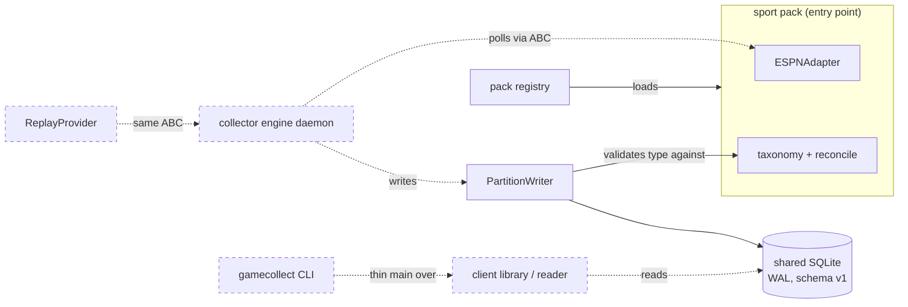
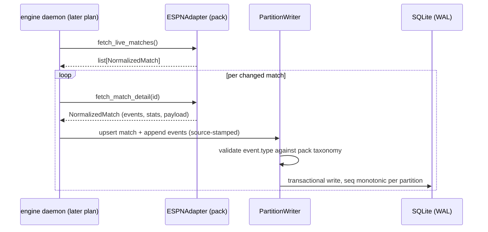

# Task: Collector foundation — scaffold, schema v1, sport-pack SDK, football pack

**Status**: In Review
**Component**: collector
**Assigned to**: Claude
**Priority**: High
**Branch**: feature/collector-scaffold
**Created**: 2026-07-02
**Completed**:

## Objective

Stand up the gamealerts-collector project per `docs/DESIGN.md`: package scaffold, the versioned generic SQLite schema (v1), the sport-pack SDK, and the first pack (football/FIFA WC2026) ported from gamealerts. After this plan, a football pack can normalize live ESPN data into the shared schema; interfaces (engine daemon, CLI, replay) follow in the sibling plan `20260702-feature-collector-interfaces.md`.

## Context

gamealerts (github.com/vr000m/gamealerts) is being rearchitected into planes; this repo is the data plane, extracted greenfield (see `docs/DESIGN.md`, the authoritative contract — decisions there are not re-litigated here). The existing gamealerts collector is football/WC2026-hardcoded: event taxonomy enums in `data/provider.py`, ESPN `soccer/fifa.world` endpoints in `data/espn.py`, football-shaped schema columns. This plan generalizes those into a core + pack split. gamealerts keeps its in-tree collector untouched until this project stabilizes and reaches PyPI (never consumed via a `[tool.uv.sources]` local path — that bakes absolute paths into `uv.lock` and breaks CI).

Reference code to port lives at `/Users/vr000m/Code/vr000m/gamealerts/backend/gamealerts/` — all "port" tasks below name files there.

## Requirements

- Python >= 3.11, `hatchling` build, `src/` layout, `uv`-managed; runtime dependencies: **stdlib only** (sqlite3, urllib, argparse, json, importlib.metadata) — the ESPN adapter already defaults to stdlib urllib with an injectable `http_get` (espn.py `__init__`); dev deps `pytest>=8.0`, `ruff>=0.4`.
- Schema v1 per DESIGN.md §3–4: generic core tables + JSON payload columns + `source` partition key; `schema_meta` version table; core-library-owned pragmas (WAL, busy_timeout, foreign_keys — port the pattern from gamealerts `store/db.py:45-48`); daemons/consumers refuse a newer major schema version.
- Partition-per-writer: every row a collector writes carries its `source` (tournament/provider instance); the write API scopes all writes to the connection's declared source; per-match `seq` monotonic within its partition.
- Sport-pack SDK per DESIGN.md §5: entry-point group `gamecollect.packs`; a pack supplies provider factory, event taxonomy declaration, prompt fragments, preference schema, display metadata, compaction boundaries.
- Football pack: port `MatchDataProvider` ABC + `Normalized*` dataclasses (provider.py:378-387 and the dataclasses/enums in the same file), `ESPNAdapter` (espn.py), team reconciliation (reconcile.py), and the JSON fixtures under `data/fixtures/`. Behavior parity with gamealerts is the port's acceptance bar.
- The `commentary` table does NOT exist in this schema (DESIGN.md §3) — prose belongs to consuming apps.
- No imports from gamealerts anywhere; this project is standalone.

## Review Focus

- Schema-version semantics: exactly when does a daemon refuse to start (newer major only? equal major/newer minor allowed?) — the plan pins refuse-on-newer-major; verify the migration runner enforces precisely that.
- Partition-per-writer enforcement: is it structurally enforced (write API scoped by construction) or convention? Convention-only is a finding.
- Taxonomy generalization: core stores `events.type` as pack-declared strings — verify the football pack's declared taxonomy is exactly the `EventType` enum value set from gamealerts `data/provider.py` (no silently dropped or renamed types), and that `_normalize_key_event`'s 0–2-event expansion (yellow-red split) survives the port.
- The generic `entities` table replaces football `rosters`; verify the folded-name lookup capability (`player_name_folded`, `canonical_player_name`) survives generalization — consuming voice tools depend on fold-based matching.
- Standalone-ness: `rg 'from gamealerts|import gamealerts' src/` must be empty.

## Implementation Checklist

### Phase 1: Project scaffold

**Impl files:** `pyproject.toml, uv.lock, src/gamecollect/__init__.py, src/gamecollect/cli.py, .github/workflows/ci.yml, ruff.toml, .gitignore`
**Test files:** `tests/test_scaffold.py`
**Test command:** `uv run pytest tests/test_scaffold.py -q`
**Validation cmd:** `uv run ruff format --check src tests && uv run ruff check src tests`

- `pyproject.toml`: hatchling, `requires-python >= 3.11`, no runtime deps, dev group (pytest, ruff), console script `gamecollect = "gamecollect.cli:main"`, entry-point group declaration for `gamecollect.packs`.
- `src/gamecollect/cli.py`: stub `main()` printing a not-yet-implemented notice — the console script must resolve the moment this plan merges (the real CLI lands in the interfaces plan).
- `src/gamecollect/` package skeleton with `__init__.py` exposing `__version__`.
- Generate and commit `uv.lock` (CI runs `--frozen`; refreshed in Phase 4 when `pyproject.toml` gains the football package).
- CI: GitHub Actions — `uv sync --frozen`, ruff format+check, pytest. Single job, ubuntu + macos matrix not needed yet. Second step/job: build the wheel, install it into a clean venv **without dev deps**, and run a scaffold smoke (`import gamecollect`, console script resolves). Phase 4 extends this same clean-venv path to load-pack → normalize-fixture → write-DB so Phase 1 remains commit-safe before the football pack exists.
- `tests/test_scaffold.py`: package imports, version present, entry-point group queryable via `importlib.metadata`.

### Phase 2: Schema v1 + core DB layer

**Impl files:** `src/gamecollect/db/schema.sql, src/gamecollect/db/connection.py, src/gamecollect/db/migrations.py, src/gamecollect/db/writer.py, src/gamecollect/db/reader.py, src/gamecollect/fold.py`
**Test files:** `tests/test_schema.py, tests/test_writer_partition.py, tests/test_migrations.py`
**Test command:** `uv run pytest tests/test_schema.py tests/test_writer_partition.py tests/test_migrations.py -q`
**Validation cmd:** `uv run python -c "from pathlib import Path; import tempfile; from gamecollect.db.connection import connect; p = Path(tempfile.mkdtemp()) / 'smoke.db'; conn = connect(p); conn.close(); print(p.exists())"`

- `schema.sql` v1 generic core: `schema_meta` (schema major/minor, applied_at); `matches` (PK `match_id`, `source` NOT NULL, kickoff_utc, home/away entity refs, status, minute/period, score_home/away, display_clock, `payload` JSON, updated_at); `events` (PK `(source, match_id, seq)`, `source` NOT NULL, minute/period, `type` TEXT NOT NULL, importance, actor/target entity refs, detail, `payload` JSON); `entities` (PK `(source, entity_id)`, kind TEXT — team|player|driver, display_name, name_folded, parent_entity, `payload` JSON); `standings` (PK `(source, group_key, entity_id)`, points/rank + `payload` JSON); `provider_match_map` gains a `source` column vs gamealerts — PK `(source, provider, provider_match_id)`, stamped by `PartitionWriter` like every other table (NOT ported as-is: two sources collecting the same provider-native id must not collide). `matches.match_id` remains the public identifier; when the writer has to create an unreconciled canonical id, it source-qualifies the provider-native id so client APIs that take only `match_id` stay unambiguous.
- Entity refs are **soft references**: nullable TEXT columns, no FOREIGN KEY constraints on entity refs in schema v1. `PartitionWriter` upserts `entities` rows when the provider supplies entity data; a match/event may legally land before its entities rows exist. FK-hardening is deferred to a later minor. Football schedule metadata (round, group_name, city, stadium, HT scores) lives in `matches.payload` JSON — not core columns, not a side table; verify no ported reader query filters/sorts on a now-JSON field.
- `fold.py`: core-owned name-folding function shared by writer and reader (write-fold == query-fold by construction); pack reconciliation (`canonical_*`) calls into it.
- `connection.py`: `connect(path, *, side_table_ddl=())` sets `journal_mode=WAL`, `busy_timeout=5000`, `foreign_keys=ON` (port `store/db.py:45-48` pattern); applies schema when missing; refuses to open when `schema_meta` major > library major; then applies any pack-owned additive `side_table_ddl` after core schema/migrations in the same connection setup path.
- `migrations.py`: ordered additive migrations keyed by (major, minor); the rosters-folded back-add in gamealerts `_apply_schema` is the pattern to generalize.
- `writer.py`: `PartitionWriter(conn, source, taxonomy=None)` — final constructor signature, pinned here so it does not churn in Phase 3. All inserts/upserts stamp `source`; raises on any attempt to write a row whose `source` differs. `seq` is **provider-derived** (`NormalizedEvent.seq`, from the ESPN keyEvents index after any 0–2-event expansion) — the writer does NOT allocate it; it enforces monotonic-per-(source, match) as an invariant and is idempotent via `INSERT OR IGNORE` on `(source, match_id, seq)`, preserving gamealerts' re-poll semantics. `taxonomy` is opaque set-of-strings data; validation is skipped when `None` so the core writer stays sport-agnostic (wired by Phase 3, exercised with a real pack in Phase 4).
- `reader.py`: untyped low-level reads used by the client library later (`list_matches`, `get_state`, `get_events_since`, `get_standings`, entity lookups by folded name). Per DESIGN.md §3 the DB is read-only to everyone but collector daemons: `reader.py` opens read-only / issues no DML, and a test asserts this.
- Tests: pragma values asserted on a fresh connection; two concurrent writer **processes** (different sources) on one file under sustained load — asserting defined retry/backoff behavior when `SQLITE_BUSY` bites (see the WAL assumption in Architecture Decisions; writes serialize file-wide, they do not interleave concurrently); cross-partition write raises; schema-version policy all three cases (equal-major/newer-minor opens OK, equal-major/older-minor triggers additive migration, newer-major refuses); migration idempotency; fold round-trip consistency (write-fold == query-fold); folded lookup returns diacritic-named entities (Türkiye, Côte d'Ivoire).

### Phase 3: Sport-pack SDK

**Impl files:** `src/gamecollect/packs/__init__.py, src/gamecollect/packs/spec.py, src/gamecollect/packs/registry.py, src/gamecollect/provider.py`
**Test files:** `tests/test_pack_registry.py, tests/test_provider_abc.py`
**Test command:** `uv run pytest tests/test_pack_registry.py tests/test_provider_abc.py -q`
**Validation cmd:** `uv run python -c "from gamecollect.packs.registry import load_pack; p = load_pack('test-fixture'); print(p.name)"`

- `provider.py`: port `MatchDataProvider` ABC (`fetch_live_matches`, `fetch_match_detail`) + `Normalized*` dataclasses from gamealerts `data/provider.py`, generalized: `event_type` becomes `str` (pack-validated), `MatchStatus` stays a core enum, football-specific `NormalizedStats`/`NormalizedLineup*` move to the football pack, `NormalizedMatch` gains `payload: dict` for sport extras. Port `ProviderError`/`ShapeDriftError`/`ProviderUnavailableError` unchanged.
- `spec.py`: `SportPack` dataclass — `name`, `sport`, `provider_factory`, `taxonomy: dict[str, EventTypeDecl]` (display name, importance default), `prompt_fragments: dict[str, str]`, `preference_schema: dict` (JSON-schema-shaped), `display_metadata: dict`, `compaction_boundaries: list[str]`, `side_table_ddl: tuple[str, ...]` (additive DDL passed to `connect(path, side_table_ddl=pack.side_table_ddl)` after core schema — the "packs may own typed side tables" hook; Phase 4 only supplies the DDL).
- `registry.py`: discover packs via `importlib.metadata.entry_points(group="gamecollect.packs")`; validate a loaded pack against **all six** DESIGN.md §5 contributions (provider factory returns a `MatchDataProvider`, taxonomy non-empty, `prompt_fragments`, `preference_schema`, `display_metadata`, `compaction_boundaries` present/well-formed); test that a pack missing any is rejected loudly.
- Taxonomy validation wiring: Phase 3 passes the active pack's taxonomy into the `PartitionWriter(conn, source, taxonomy=None)` parameter defined in Phase 2; the writer rejects an event `type` not in the taxonomy (explicit, loud — shape drift shows up at write time, mirroring gamealerts' `ShapeDriftError` philosophy). The loud-rejection test with a real pack lands in Phase 4.
- Minimal in-repo test-fixture pack named `test-fixture` registered via a real entry point (dev environment only) so `tests/test_pack_registry.py` exercises discovery through `importlib.metadata` before the football pack exists — no mocks.

### Phase 4: Football/WC2026 pack

**Impl files:** `pyproject.toml, uv.lock, src/gamecollect_football/__init__.py, src/gamecollect_football/pack.py, src/gamecollect_football/espn.py, src/gamecollect_football/reconcile.py, src/gamecollect_football/taxonomy.py, src/gamecollect_football/fixtures/*.json`
**Test files:** `tests/football/test_espn_adapter.py, tests/football/test_reconcile.py, tests/football/test_taxonomy_parity.py, tests/football/test_card_counts.py, tests/football/test_espn_event_mapping.py, tests/football/golden/qatar_canada_760440.normalized.json`
**Test command:** `uv run pytest tests/football -q`
**Validation cmd:** `uv run python -c "from gamecollect.packs.registry import load_pack; p = load_pack('football-wc2026'); print(p.name, len(p.taxonomy))"`

- Ship in-repo as a second package (`gamecollect_football`) with its own entry point, proving the SDK from the outside; same wheel for now. This **modifies `pyproject.toml`**: register the `football-wc2026` entry point under `gamecollect.packs` and add the second package to the hatchling build target; refresh `uv.lock` and run `uv sync` before the validation cmd (registry discovery needs the entry point installed).
- Extend the Phase 1 clean-venv CI smoke so the installed wheel loads `football-wc2026`, normalizes the checked-in ESPN fixture, and writes a temp DB without dev dependencies.
- `taxonomy.py`: the `EventType` value set + `EventImportance` defaults from gamealerts `data/provider.py`, as data.
- `espn.py`: port `ESPNAdapter` and its private helpers (`_normalize_key_event` incl. yellow-red split, `_normalize_roster`, `_normalize_team_stats`, `_classify_goal_slug`, `_MAX_RESPONSE_BYTES` guard); tournament (`fifa.world`) becomes a constructor parameter with WC2026 default. **Named assumption**: ESPN per-tournament endpoint shape/slug uniformity is unverified beyond `fifa.world` — a probe/record of one other tournament's scoreboard+summary is required before claiming any second tournament is config-only.
- `reconcile.py`: port `TEAM_ALIASES`, `canonical_display_name`, `canonical_team_name`, `canonical_player_name`, `resolve_canonical_match_id`, `register_unreconciled_match` (DAO calls rewritten against `writer.py`/`reader.py`; newly-created unreconciled ids are source-qualified so `matches.match_id` stays globally unambiguous).
- Copy `data/fixtures/qatar_canada_760440.summary.json` (+ worldcup schedule/squads fixtures) for adapter tests. Check in a **frozen golden normalized-output JSON** captured once from gamealerts' adapter; parity tests assert against that file (gamealerts is never imported at test time). Porting `test_card_counts.py` and `test_espn_event_mapping.py` is **mandatory** (they exist in gamealerts), with explicit assertions for the 2-event second-yellow split and the 0-event unknown-slug skip. Coverage limit: the parity fixture is a FINISHED match — live IN_PLAY normalization is unverified by it; live-path parity is scoped to the interfaces/replay plan.
- Football side tables (stats, lineups) as pack-owned DDL supplied via the `SportPack.side_table_ddl` hook (applied by `connect()` after core schema) — exercises the "packs may own typed side tables" contract. Test: snapshot core-table schema before/after pack side-table registration and assert equality (core tables never altered by a pack).
- Loud-rejection test with the real pack: an event `type` outside the football taxonomy raises at write time.

## Technical Specifications

### Files to Modify
- `pyproject.toml` (created in Phase 1, modified in Phase 4: football entry point + second hatchling build target) and `uv.lock` (generated Phase 1, refreshed Phase 4). Otherwise greenfield (only `README.md`, `docs/DESIGN.md` exist).

### New Files to Create
- See per-phase **Impl files** above; layout is `src/gamecollect/` (core) + `src/gamecollect_football/` (first pack) + `tests/`.

### Architecture Decisions
- **stdlib-only runtime**: verified feasible — gamealerts' ESPN adapter defaults to stdlib urllib (injectable `http_get`), storage is sqlite3, CLI will be argparse. Keeps the OSS artifact trivially installable.
- **`src/` layout** (vs gamealerts' flat layout): fresh library convention; prevents accidental repo-root imports in tests.
- **Two packages, one repo**: `gamecollect` (core+SDK) and `gamecollect_football` (pack) — the pack consumes the SDK only through public API + entry points, keeping the SDK honest from day one.
- **`events.type` as pack-declared strings** validated at write time (not a core enum): the core stays sport-agnostic; drift is caught loudly at the writer, consistent with gamealerts' `ShapeDriftError` posture.
- **Refuse-on-newer-major** schema policy: equal-major/any-minor is compatible (minor = additive only); newer major refuses at `connect()`.
- **`entities` replaces rosters/teams**: kind-discriminated (team/player/driver), with `name_folded` preserving the fold-based lookup gamealerts depends on.
- **Soft entity refs in v1**: entity ref columns in `matches`/`events`/`standings` are nullable TEXT with no FK constraints — the ported pipeline is name-keyed and a match/event may land before its entities rows. `PartitionWriter` upserts entities when the provider supplies them; FK-hardening deferred to a later minor.
- **Provider-derived `seq`**: the normalizer supplies `seq`; the writer enforces monotonic-per-(source, match) and stays idempotent via `INSERT OR IGNORE` on `(source, match_id, seq)` — re-poll parity with gamealerts, no writer-side counter.
- **Core-owned fold**: the name-folding function lives in `gamecollect` (`fold.py`) and is shared by writer and reader; packs call into it, so write-fold == query-fold by construction.
- **Named assumption — WAL concurrency**: SQLite WAL serializes writers file-wide; partition-per-source does NOT grant concurrent writes. Multi-daemon safety depends on `busy_timeout` absorbing `SQLITE_BUSY`, tested under sustained contention. Two writers on the same (file, source) is a documented-unsupported misconfiguration: last-write-wins on matches, seq races possible; a test asserts the outcome is bounded (no corruption, no crash). Structural locking is deferred to the interfaces-plan engine.
- **Named assumption — ESPN tournament uniformity**: shape/slug taxonomy is verified only against `fifa.world`; a second tournament requires a recorded probe before it is treated as config-only.
- **Schedule metadata in payload**: football round/group/city/stadium/HT scores live in `matches.payload` JSON, keeping core columns sport-agnostic.

### Dependencies
- Runtime: none. Dev: `pytest>=8.0`, `ruff>=0.4` (matching gamealerts `backend/pyproject.toml` pins). Build: `hatchling`.

### Integration Seams

| Seam | Writer (task) | Caller (task) | Contract |
|------|---------------|---------------|----------|
| schema v1 DDL | Phase 2 `schema.sql` | Phase 3 taxonomy hook, Phase 4 side tables | Core tables immutable within major; packs add side tables only, never alter core |
| connection setup | Phase 2 `connection.py` | Phase 4 pack; interfaces-plan engine | `connect(path, *, side_table_ddl=())` owns pragmas, schema/migrations, newer-major refusal, and pack side-table DDL application after core schema |
| `PartitionWriter` | Phase 2 | Phase 4 reconcile port; interfaces-plan engine | Constructor `PartitionWriter(conn, source, taxonomy=None)`; all writes stamped with constructor `source`; cross-source write raises; `seq` provider-derived, monotonic per `(source, match)`, idempotent via `INSERT OR IGNORE` on `(source, match_id, seq)` |
| provider ABC | Phase 3 `provider.py` | Phase 4 `ESPNAdapter`; interfaces-plan `ReplayProvider` | `fetch_live_matches() -> list[NormalizedMatch]`, `fetch_match_detail(id)`; errors via `ProviderError` hierarchy only |
| pack entry point | Phase 3 registry | Phase 4 pack; interfaces-plan CLI `--pack` flag | group `gamecollect.packs`; value is a zero-arg factory returning `SportPack` |
| taxonomy | Phase 4 `taxonomy.py` | Phase 2 writer param (wired in Phase 3, tested in Phase 4) | Event `type` strings written must be declared by the active pack; validation skipped when `taxonomy=None` |

## Architecture & Call Flow

> Shared topology for this repo (both plans); this plan builds the solid-line components, the interfaces plan (`20260702-feature-collector-interfaces.md`) adds the dashed ones.

Component graph — which component triggers which:

Trigger order — one collection cycle (engine lands in the interfaces plan; shown for contract context):

Context lifecycle — what enters each step's working state and whether it clears or persists:

| Step | Trigger | Enters context | Cleared/persisted | Turn boundary |
|------|---------|----------------|-------------------|---------------|
| 1 | daemon start (later plan) | pack (via registry), DB path, source id | pack immutable for process life; connection persists | process lifetime |
| 2 | poll tick | provider HTTP responses (bounded 16 MB) | discarded after normalize | per tick |
| 3 | normalize | `Normalized*` dataclasses | discarded after write | per match |
| 4 | write | source-stamped rows | persisted to SQLite (durable) | per transaction |
| 5 | consumer read (later plan) | reader query results | caller-owned | per call |

## Testing Notes

### Test Approach
- [ ] Unit: schema/pragma/migration behavior on temp DB files (no shared state between tests); version policy all three cases
- [ ] Unit: partition writer discipline (two sources, one file; every written core row carries `source`; cross-source raise; provider-derived seq monotonicity + `INSERT OR IGNORE` idempotency on `(source, match_id, seq)`)
- [ ] Unit: fold round-trip (write-fold == query-fold) and folded lookup with diacritic names
- [ ] Unit: pack registry discovery via real entry points (in-repo test-fixture pack in Phase 3; football pack in Phase 4 — not mocks); registry rejects a pack missing any of the six §5 fields
- [ ] Parity: ESPN adapter against the checked-in `qatar_canada_760440.summary.json` fixture — normalized output equals the checked-in golden JSON captured once from gamealerts' adapter (gamealerts never imported at test time)
- [ ] Wheel-only: CI builds the wheel, installs into a clean venv without dev deps, runs load-pack → normalize → write end-to-end
- [ ] Standalone check: `rg 'from gamealerts|import gamealerts' src/` is empty

### Test Results
- [ ] All tests pass (`uv run pytest -q`)
- [ ] Lint clean (`ruff format --check` + `ruff check`)
- [ ] CI green on GitHub Actions

### Edge Cases Tested
- [ ] Two writer processes, same file, same source — documented-unsupported misconfiguration; test asserts the outcome is bounded (no corruption, no crash), not prevented
- [ ] Two writer processes, same file, different sources — writes serialize under WAL; test asserts defined retry/backoff under `SQLITE_BUSY` contention
- [ ] Event with undeclared `type` — loud rejection (real-pack test in Phase 4)
- [ ] DB at future major — `connect()` refuses with actionable message; equal-major newer/older minor both handled
- [ ] Non-ASCII team/player names through fold pipeline (Türkiye, Côte d'Ivoire, diacritics) — wired to the Phase 2 folded-lookup test
- [ ] Core-table schema unchanged after pack side-table registration

## Acceptance Criteria

- `uv run pytest -q` green; CI green on the PR.
- A fresh venv with only this wheel installed can: load the football pack via entry point, normalize the checked-in ESPN fixture, and write it into a new SQLite file with correct pragmas and schema v1.
- ESPN adapter parity: same fixture in → normalized events equal to the checked-in golden JSON captured from gamealerts' adapter (documented field mapping for the generalized bits; gamealerts never imported at test time).
- `rg 'from gamealerts|import gamealerts' src/` returns no matches.
- Tests passing, code reviewed, `docs/DESIGN.md` amended if any contract detail was refined during implementation.

<!-- reviewed: 2026-07-02 @ bd5fb6af0fd4a2d958a612b3f5028662fd5844d4 -->

## Progress

- [x] Phase 1: Project scaffold
- [x] Phase 2: Schema v1 + core DB layer
- [x] Phase 3: Sport-pack SDK
- [x] Phase 4: Football/WC2026 pack

## Findings

- **All Phase 2/3/4 reviewer findings below were FIXED post-run** (commit "fix: apply phase-review findings"): child-table writes now verify match ownership (`_assert_match_owned` in `append_events`/`map_provider_match`), `upsert_match` carries a `WHERE matches.source = excluded.source` conflict guard + rowcount check (TOCTOU closed), `upsert_entity` always stamps the core fold and rejects mismatched `name_folded`, `open_reader` refuses any major mismatch (symmetric with `connect()`), `_pick` takes per-table key sets (cross-table keys rejected loudly), `validate_pack` checks `EventTypeDecl` contents, the loose `pytest.raises(Exception)` tests are pinned to `PackValidationError`/`TaxonomyError`, and reconcile step (b) is source-scoped. 10 regression tests added (169 passed, 2 skipped). The worldcup schedule/squads fixtures stay in the wheel deliberately — the interfaces-plan schedule loader consumes them.
- Phase 2 reviewer (advisory — resolved, see above):
  - **Important / Contract (fixed)**: partition enforcement is structural for `matches` but convention-only for child tables — `writer.py` `append_events`/`upsert_standing`/`map_provider_match` never verify `match_id` ownership against `matches.source`; a writer scoped to source B can create a shadow event partition under source A's match, breaking the match_id-global reader contract (`get_events_since` takes no source).
  - Minor / Bug (fixed): `upsert_match` owner check is SELECT-then-INSERT (TOCTOU); racing writers with different sources can silently overwrite row data while `source` keeps the original value. Suggest `ON CONFLICT ... DO UPDATE ... WHERE matches.source = excluded.source` + changes() check.
  - Minor / Contract (fixed): `upsert_entity` accepts caller-supplied `name_folded`, bypassing the core fold (breaks write-fold == query-fold "by construction").
  - Minor / Clarity (fixed): `open_reader` refuses only newer-major while `connect()` also refuses older-major — asymmetry undocumented.
  - Minor / Bug (fixed): `_pick` whitelists all tables' key columns for every table, so cross-table keys (e.g. `seq` in a match row) are silently dropped despite the loud-rejection comment.
- Phase 3 reviewer (advisory, minor — resolved): (1) `validate_pack` doesn't validate `EventTypeDecl` contents (empty display_name / None importance_default pass); (2) two registry rejection tests use `pytest.raises(Exception)` instead of pinning `PackValidationError`. Reviewer verified the dev-only `test-fixture` pack uses a relative `[tool.uv.sources]` editable path (no absolute paths in uv.lock, `uv lock --check` passes) and cannot leak into the runtime wheel (no Requires-Dist).
- Phase 4 reviewer (advisory, minor — (1) resolved, (2) kept deliberately): (1) `reconcile.py` `resolve_canonical_match_id` step (b) uses source-blind `reader.get_state`, so a bare provider-native id can bind cross-source in a shared multi-source DB (compounds the Phase 2 Important finding — fix together: source-scope step (b)); (2) `worldcup.json`/`worldcup.squads.json` fixtures ship in the wheel but are consumed by no test or code yet (dead package data until the interfaces-plan schedule loader).
- Phase 4 parity verified by reviewer: taxonomy == gamealerts EventType value set exactly (9 types, identical importance defaults); `_normalize_key_event` 0–2 expansion ported byte-for-byte; golden byte-exact; unreconciled ids source-qualified; core tables untouched by pack DDL.
- Phase 2 note: two migration tests skip honestly — no equal-major/older-minor DB is constructible until the first additive migration exists (library is at v1.0); they activate with the first minor bump.

## Issues & Solutions

- (none yet)

## Final Results

Completed 2026-07-02 by `/conduct --autonomous` (4 phases, 0 fix-loop iterations, all parallel spawns).

- Phase commits: `bf05d16` (scaffold), `2bd0f90` (schema v1 + DB layer), `1f762ca` (sport-pack SDK), `c1a60a8` (football pack).
- Tests: 159 passed, 2 skipped (honest skips: no equal-major/older-minor DB constructible until the first additive migration). Lint clean (`ruff format --check` + `ruff check`).
- CI-parity gate (local, `--ci-cmd` override — no just/make/npm entrypoint): `uv sync --frozen` + ruff format/check + full pytest → exit 0.
- Wheel smoke (CI's exact script, clean venv, no dev deps): loads `football-wc2026`, normalizes the fixture via injected `http_get`, writes 24 events to a temp DB with pack side tables. Console script resolves.
- Standalone: `rg 'from gamealerts|import gamealerts' src/` empty; golden captured once via `tests/football/golden/capture_golden.py` (gamealerts never imported at test time).
- Taxonomy parity: 9 event types, exact gamealerts `EventType` value set with identical importance defaults; yellow-red 0–2 expansion ported byte-for-byte; golden byte-exact.
- Note: the plan header `**Status**: Not Started` sits above the review marker (immutable contract section) and was deliberately left unedited to preserve the marker hash.
- Outstanding before merge (see Findings): Phase 2 Important cross-partition child-table gap + Phase 4 minor source-blind resolve step (fix together); minor items from Phases 2–4; CI green on GitHub Actions still pending push.
