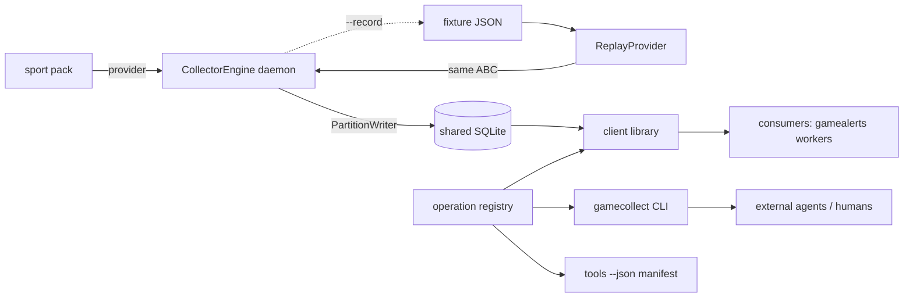
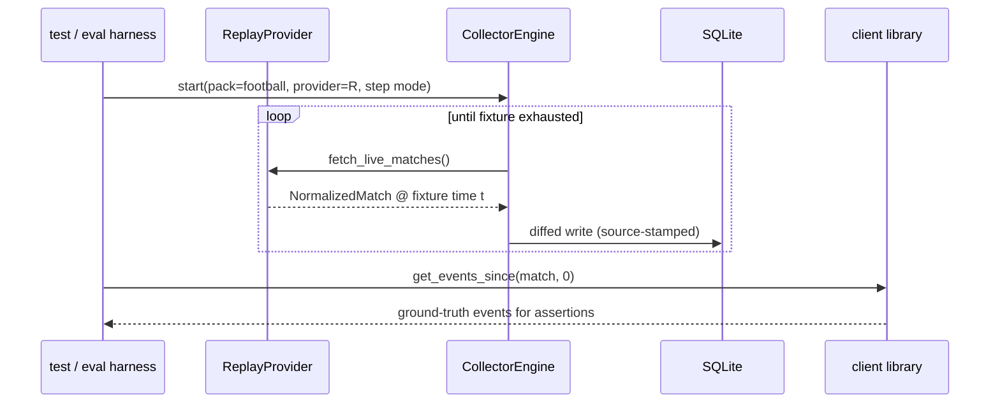

# Task: Collector interfaces — engine daemon, client library, gamecollect CLI, ReplayProvider + fixtures

**Status**: Not Started
**Component**: collector
**Assigned to**: Claude
**Priority**: High
**Branch**: feature/collector-interfaces
**Created**: 2026-07-02
**Completed**: 2026-07-04

## Objective

On top of the foundation plan (`20260702-feature-collector-foundation.md` — scaffold, schema v1, pack SDK, football pack), build the pieces consumers touch: the collection engine daemon, the client library, the `gamecollect` CLI with its self-describing `tools --json` manifest, and `ReplayProvider` with seed fixtures imported from gamealerts' databases.

**Depends on:** the foundation plan being complete (schema v1, `PartitionWriter`, provider ABC, football pack). Do not start `/conduct` on this plan before the foundation plan's Progress section shows all phases done.

## Context

`docs/DESIGN.md` §6–7 define the interface contract: the client library is canonical; the CLI is a thin `main()` over it whose `--json` output schemas ARE the public contract; a manifest enables runtime capability discovery (chosen over MCP on the working assumption that our consuming agents do not act on MCP tool-list updates — MCP does define `notifications/tools/list_changed`, but we have not observed clients honoring it; consuming agents regenerate function-calling tool definitions from the manifest instead). `ReplayProvider` is a first-class provider, not test scaffolding: it is the eval/hardening harness for any consumer (gamealerts' game workers replay recorded matches and assert commentary behavior against ground truth).

Fixture ground truth (snapshot as of 2026-07-02, re-verified 2026-07-03, against the live DBs — note this corrects the DESIGN.md §7 fixture list's ambiguity about which DB holds what). These are live, mutable databases with active WAL files: the importer must re-assert these counts/scores/schema shapes at import time and fail loudly on mismatch rather than trusting this snapshot.
- Real DB (`~/.local/share/gamealerts/gamealerts.db`): Morocco–Haiti `espn:760464` 4–2 FINISHED, 21 events; New Zealand–Belgium `espn:760477` 1–5 FINISHED, 20 events; Turkey–USA `espn:760470` 3–2 FINISHED, 18 events. (Commentary rows exist but are NOT imported — prose is out of scope per DESIGN.md §3.)
- Fictional DB (`~/.local/share/gamealerts/gamealerts-fictional.db`): Canada–Qatar `2026-06-18_canada_vs_qatar_9` 6–0 FINISHED, 6 events (Jonathan David hat-trick — the context-awareness test case), 0 commentary rows. Its schema is older: `rosters` lacks `player_name_folded`, no `lineups` table — the importer must tolerate both shapes.

## Requirements

- Engine daemon: one process per tournament (source); load pack → poll provider → diff → write via `PartitionWriter`; inspired by gamealerts `collector/session.py` poll-loop mechanics, but specified self-contained in Phase 1 below (that file is not in this repo, so the ported behavior is written out rather than referenced), minus everything prose/voice (`summarizer.py` is explicitly NOT ported).
- Client library: `list_matches`, `get_state`, `get_events_since(match_id, since_seq)`, `get_standings` are core operations over core tables; `get_squad` and `get_player_stats` read pack-owned side tables (`football_lineups`/`football_stats`) and are therefore **pack-contributed operations** — the football pack registers them into the operation registry; core `client.py` never imports `gamecollect_football`. All ops are sync, typed returns, read-only, safe to call while daemons write (WAL). `match_id` is globally unique (the foundation plan source-qualifies unreconciled canonical ids), so **match-scoped** ops (`get_state`, `get_events_since`, `get_squad`, `get_player_stats(match_id, ...)`) resolve `source` internally via the `matches` row. `get_standings` is NOT match-scoped (standings are keyed `(source, group_key, entity_id)`) and takes an explicit `source` parameter; `list_matches` accepts an optional `source` filter.
- CLI `gamecollect`: argparse; every read subcommand has `--json`; `gamecollect tools --json` emits the manifest (subcommand names, args, output JSON Schemas) generated from the same registry the library exposes — the CLI cannot drift from the library by construction.
- `ReplayProvider(fixture, speed=1.0)`: implements the provider ABC; replays a recorded fixture with original or accelerated timing; `speed=inf` (or `step()` mode) for deterministic tests.
- Fixture format: JSON files checked into the repo (portable, diffable, no binary DBs in git) + an importer script that exports them from a gamealerts-schema SQLite file.
- Recording symmetry: the engine can write a replayable fixture of any live session (`--record` flag).

## Review Focus

- Manifest/CLI/library single-source-of-truth: verify the manifest is generated from the same registry that drives argparse wiring — a hand-maintained manifest is a finding.
- JSON output schema stability: these schemas are the public contract; verify they are versioned (manifest carries `contract_version`) and covered by golden-file tests.
- ReplayProvider determinism: with `speed=inf`/step mode, two runs over the same fixture must produce identical **logical** DB content — compared as canonical ordered row dumps of `matches`/`events`/`entities` (JSON), NOT raw `.db` file bytes (SQLite page allocation/freelist/WAL state is not byte-stable). `updated_at` is either supplied deterministically by the replay path (from fixture event time — the writer auto-stamps `_utcnow()` when omitted and has no clock injection) or excluded from the comparison.
- Importer tolerance of the two known gamealerts schema shapes (fictional DB: no `player_name_folded`, no `lineups`).
- Engine failure posture: provider errors (`ProviderUnavailableError`, `ShapeDriftError`) must not wedge the poll loop; verify backoff and loud logging, mirroring gamealerts' collector behavior.

## Implementation Checklist

### Phase 1: Collection engine daemon

**Impl files:** `src/gamecollect/engine.py, src/gamecollect/diffing.py, src/gamecollect/fixture_io.py`
**Test files:** `tests/test_engine.py, tests/test_fixture_io.py`
**Test command:** `uv run pytest tests/test_engine.py tests/test_fixture_io.py -q`

- `engine.py`: `CollectorEngine(pack, db_path, source, poll_interval)` — poll loop, self-contained spec (gamealerts `collector/session.py` inspired the mechanics but is not in this repo, so the contract lives here): jittered interval (uniform ±20% of `poll_interval`); exponential backoff on provider errors (base = poll interval, doubling, capped at 8× base, reset on first success); graceful shutdown on SIGTERM; opens the DB with `connect(db_path, side_table_ddl=pack.side_table_ddl)` before constructing `PartitionWriter(conn, source, taxonomy=pack.taxonomy)` so pack side tables and taxonomy validation are active. No prose, no IPC.
- Provider-error posture (per Review Focus): `ProviderUnavailableError` → backoff + retry, loop survives; `ShapeDriftError` → loud log (ERROR with payload context) + backoff + retry, loop survives; both are non-fatal.
- `diffing.py`: compute new events (by seq) and changed match state between polls so writes are minimal — compare the provider snapshot against the last-written state held in engine memory; only changed matches get `upsert_match`, only unseen seqs get `append_events`.
- `fixture_io.py` (moved into Phase 1 so `--record` has its writer in-phase): fixture JSON format — match header + ordered events with original timestamps/minutes + entities snapshot + standings snapshot (nullable, for sources that have them); `write_fixture`/`read_fixture`; format version field. Phase 4's replay/importer consume this module unchanged.
- Seeding via pack hook (write-order constraint from the foundation writer's adversarial-review fix): `append_events`/`map_provider_match` raise `UnseededMatchError` unless the match row already exists under this source — the engine must seed first. The engine calls `pack.seed_match(conn, writer, match) -> str | None` — a **new SportPack contract hook added in this phase** (amends the foundation pack spec; core engine must never import `gamecollect_football`). The football pack implements `seed_match` with its existing `register_unreconciled_match(conn, writer, match)` (reconciled paths go through `upsert_match`): a `str` return always names a seeded row; `None` means identity fields were missing and the engine skips child writes for that match this poll. The pinned semantics (seed via upsert/register before `append_events`, `None` = skip) are unchanged — only the call surface moves onto the pack.
- Re-poll drift constraint (from the /code-review + second Codex adversarial fixes): `append_events` raises `SequenceError` when a re-sent seq's full fingerprint (`type` plus every event column — minute, period, importance, actor/target, detail, payload) differs from the stored row (positional seqs shifted, e.g. a keyEvent inserted or removed mid-match). The engine's poll loop must treat this as provider drift for that match (log + skip or re-sync), not as a fatal daemon error.
- Tests: fake provider (scripted `NormalizedMatch` sequences) drives the engine against a temp DB; assert idempotent re-poll (no duplicate events), backoff on `ProviderUnavailableError`, backoff + loud log + loop survival on `ShapeDriftError`, clean shutdown. Drift test: fake provider re-sends a seq with a mutated fingerprint → engine logs loudly, skips/re-syncs that match, other matches keep collecting, daemon stays up. Seeding tests: (1) match with missing identity fields → `seed_match` returns `None` → no child writes, no `UnseededMatchError`; (2) seedable match → seed precedes append, events land. `fixture_io` round-trip tests including a zero-event (scheduled) fixture synthesized via `write_fixture`.

### Phase 2: Client library

**Impl files:** `src/gamecollect/client.py, src/gamecollect/registry.py`
**Test files:** `tests/test_client.py`
**Test command:** `uv run pytest tests/test_client.py -q`

- `client.py`: the four **core** read functions (`list_matches`, `get_state`, `get_events_since`, `get_standings`) over `db/reader.py`, typed returns (dataclasses), read-only connections. `get_standings(source, group_key)` takes `source` explicitly (standings have no `match_id` to resolve it from); match-scoped ops resolve `source` via the `matches` row.
- `registry.py`: the operation registry — each operation declares name, params (name/type/required), summary, and output JSON Schema. Core library functions are registered here, and the registry accepts **pack-contributed operations**: a SportPack may register additional read ops (football contributes `get_squad`/`get_player_stats` over its side tables, implemented in `gamecollect_football`, registered when the pack loads). CLI and manifest are both generated from the merged registry; core never imports pack modules.
- Tests: seed a temp DB via `PartitionWriter`, exercise every core operation plus the football pack-contributed ops (pack loaded in-test); `get_events_since` pagination/monotonicity; read-while-write under WAL with an explicit interleaving — writer connection commits batch 1, reader (separate read-only connection) asserts it sees exactly batch 1 while the writer holds an open transaction with batch 2 uncommitted, then sees batch 2 after commit; reader must never error or block.

### Phase 3: gamecollect CLI + tools manifest

**Impl files:** `src/gamecollect/cli.py`
**Test files:** `tests/test_cli.py, tests/golden/manifest.json, tests/golden/*.json`
**Test command:** `uv run pytest tests/test_cli.py -q`
**Validation cmd:** `uv run gamecollect tools --json | uv run python -m json.tool > /dev/null`

- `cli.py`: argparse subcommands generated from the merged operation registry (`matches`, `state`, `events`, `standings` core; `squad`, `player-stats` appear when the football pack is loaded) + `collect` (runs the engine: `--pack`, `--db`, `--source`, `--record`) + `tools --json`. `collect` is unit-tested in-phase with a fake provider; its ReplayProvider acceptance run lands in Phase 4's end-to-end test.
- Manifest: `{contract_version, operations: [{name, params, output_schema}]}` — emitted from the registry, never hand-written.
- Golden-file tests: manifest and one sample `--json` output per operation checked in; schema changes show up as reviewable diffs. Golden sample data comes from a synthetic `PartitionWriter`-seeded temp DB (the Phase 2 pattern) — NOT from Phase 4 fixtures, so Phase 3 stays committable before Phase 4.
- Single-source-of-truth test (registry-derivation proof, not just golden files): derive at runtime and assert equal — `set(registry op names) == set(CLI subparser names) == set(manifest operation names)`, and each manifest entry's `params`/`output_schema` is the registry object's, not a literal.

### Phase 4: ReplayProvider + fixture import

**Impl files:** `src/gamecollect/replay.py, scripts/import_gamealerts_fixtures.py, fixtures/football/*.json, tests/assets/gamealerts_mini_new.db, tests/assets/gamealerts_mini_old.db`
**Test files:** `tests/test_replay.py, tests/test_importer.py`
**Test command:** `uv run pytest tests/test_replay.py tests/test_importer.py -q`
**Validation cmd:** `uv run python scripts/import_gamealerts_fixtures.py --check fixtures/football`

- `replay.py`: `ReplayProvider` implementing the ABC; wall-clock pacing by original event spacing scaled by `speed`; `step()` mode for tests; terminal state = FINISHED match. In step mode the replay path supplies `updated_at` deterministically from fixture event time (the writer auto-stamps wall clock when omitted).
- `scripts/import_gamealerts_fixtures.py`: reads a gamealerts-schema SQLite file (both known shapes: with/without `player_name_folded` and `lineups`), exports named matches to fixture JSON via Phase 1's `fixture_io`; `--check` validates existing fixtures parse and replay deterministically. At import time it re-asserts the ground-truth snapshot (event counts, scores, status) against the source DB and fails loudly on mismatch — the live DBs are mutable.
- Event-field mapping (gamealerts → collector; the gamealerts events schema is external to this repo, so this map is the contract): gamealerts `(match_id, seq, minute, type, detail, team, player, assist)` → collector `(minute, period, type, importance, actor_entity, target_entity, detail, payload)`. `player` → synthesised `actor_entity` id (folded name, source-qualified), `assist` → `target_entity`, `team` → entity `parent_entity`, `type` → football taxonomy key with `importance` derived from the pack taxonomy, `period` inferred from `minute` (1 ≤45+ST, 2 otherwise; NULL if minute missing), leftover columns into `payload`. Importer verification step: every distinct gamealerts `type` in the four seed matches has a taxonomy entry — fail the import otherwise.
- Synthetic importer test assets: two tiny checked-in gamealerts-schema SQLite files — `tests/assets/gamealerts_mini_new.db` (with `player_name_folded` + `lineups`) and `tests/assets/gamealerts_mini_old.db` (without) — generated by a fixture-builder helper in `tests/test_importer.py`; CI never touches `~/.local/share/gamealerts/`. The live-DB path is used only for the one-time seed import.
- Import and check in the four seed fixtures: `morocco-haiti-espn760464`, `nz-belgium-espn760477`, `turkey-usa-espn760470` (real DB), `canada-qatar-fictional` (fictional DB).
- Determinism test: replay the same fixture twice into two temp DBs; compare canonical ordered row dumps (JSON) of `matches`/`events`/`entities` (and standings if present), with `updated_at` pinned by the replay path or excluded — never raw `.db` bytes.
- End-to-end test: `CollectorEngine` + `ReplayProvider(canada-qatar, step mode)` → assert final DB state matches fixture ground truth (6 events, 6–0, David ×3) via the client library. This e2e exercises `matches`/`state`/`events` (and `squad` if the entities snapshot carries roster membership); `standings`/`player-stats` are exercised against a directly-seeded temp DB in Phases 2–3, since fixtures for these seed matches may not carry those tables.

## Technical Specifications

### Files to Modify
- `README.md` — usage section once the CLI exists (install, `gamecollect collect`, `gamecollect events --json`).
- `docs/DESIGN.md` — record the fixture-location correction (which DB holds which seed match), the fixture JSON format reference, the `pack.seed_match` hook, and pack-contributed operations.
- `src/gamecollect/packs/spec.py` — SportPack contract amendment: `seed_match(conn, writer, match) -> str | None` hook (Phase 1) and pack-contributed operation declarations (Phase 2).
- `src/gamecollect_football/` — implement `seed_match` (wrapping `register_unreconciled_match`) and contribute `get_squad`/`get_player_stats` registry operations.

### New Files to Create
- See per-phase **Impl files**; plus `fixtures/football/` (checked-in seed fixtures) and `scripts/`.

### Architecture Decisions
- **Operation registry as single source of truth**: library functions, argparse subcommands, and the manifest all derive from one registry — drift between CLI and library is impossible by construction, and a new operation is automatically discoverable via `tools --json` (the hot-reload property that motivated CLI-over-MCP).
- **Pack-contributed operations, not core knowledge of pack tables**: `get_squad`/`get_player_stats` read football side tables, so they live in `gamecollect_football` and register into the registry at pack load. Core `client.py`/`reader.py` stay sport-agnostic; dependency direction is pack → core only.
- **Engine seeds via `pack.seed_match` hook**: the seeding/reconcile logic (`register_unreconciled_match`) is football code; the sport-agnostic engine reaches it only through a new SportPack hook. Same pinned semantics (`str` = seeded, `None` = skip child writes); the foundation SportPack spec is amended in Phase 1.
- **Fixtures as JSON in git, not SQLite**: diffable, portable, schema-migration-proof; the importer bridges from live DBs.
- **Replay pacing in the provider, not the engine**: the engine polls identically against live and replay providers — replay is invisible to it, which is what makes replay a real end-to-end harness.
- **No commentary import**: fixtures carry facts only (events/state), per the data-plane boundary.

### Dependencies
- Runtime: still stdlib-only. Dev: unchanged (pytest, ruff).

### Integration Seams

| Seam | Writer (task) | Caller (task) | Contract |
|------|---------------|---------------|----------|
| operation registry | Phase 2 | Phase 3 CLI + manifest | Registry entry = (name, params, output schema, impl); CLI/manifest generated, never hand-edited; packs may contribute ops |
| pack-contributed ops | football pack (`get_squad`, `get_player_stats`) | Phase 2 registry, Phase 3 CLI/manifest | Pack registers ops at load; core never imports pack modules |
| `pack.seed_match` hook | Phase 1 SportPack contract amendment; football pack implements via `register_unreconciled_match` | Phase 1 engine | `seed_match(conn, writer, match) -> str \| None`; `str` = seeded row id, `None` = skip child writes this poll |
| provider ABC | foundation plan | Phase 1 engine, Phase 4 replay | Engine consumes ABC only; replay indistinguishable from live |
| connection setup | foundation plan `connect(path, *, side_table_ddl=())` | Phase 1 engine | Engine passes the loaded pack's `side_table_ddl`; core schema/migrations still run before pack side-table DDL |
| fixture format | Phase 1 `fixture_io` | Phase 1 `--record`; Phase 4 importer + replay; gamealerts eval harness (external) | Versioned JSON: header + ordered timed events + entities (+ optional standings snapshot); facts only |
| `--record` output | Phase 1 engine flag | Phase 1 `fixture_io` (same phase) | Recording a live session yields a fixture `read_fixture` accepts |
| JSON output schemas | Phase 3 golden files | external consumers (gamealerts workers, third parties) | Breaking change ⇒ `contract_version` bump + golden diff in review |

## Architecture & Call Flow

> Same topology as the foundation plan's diagram (see `20260702-feature-collector-foundation.md`); this plan builds the dashed components. Sequence below shows the two consumer paths this plan enables.

Component graph — consumer paths built here:

Trigger order — replay-driven end-to-end run (the eval harness path):

Context lifecycle:

| Step | Trigger | Enters context | Cleared/persisted | Turn boundary |
|------|---------|----------------|-------------------|---------------|
| 1 | `gamecollect collect` | pack, provider (live or replay), source, DB path | engine state persists for process life | process lifetime |
| 2 | poll/step tick | provider snapshot | discarded after diff+write | per tick |
| 3 | `--record` | normalized snapshots | appended to fixture JSON (durable) | per session |
| 4 | CLI read invocation | argv → registry op → DB query | result to stdout; nothing retained | per invocation |
| 5 | `tools --json` | registry | manifest to stdout | per invocation |

## Testing Notes

### Test Approach
- [ ] Engine loop against scripted fake provider (temp DB, no network) — incl. `ShapeDriftError` posture, `SequenceError` drift, seed/`None`-skip branches
- [ ] Client library ops against seeded temp DB; read-while-write under WAL with explicit commit-boundary interleaving
- [ ] CLI golden-file tests (manifest + per-op sample output from a `PartitionWriter`-seeded synthetic DB) + registry-derivation equality test
- [ ] Replay determinism: same fixture twice ⇒ identical canonical row dumps of matches/events/entities (`updated_at` pinned or excluded; never raw file bytes)
- [ ] End-to-end: replay canada-qatar fixture through the real engine, assert ground truth via client library
- [ ] Importer against both known gamealerts schema shapes via checked-in synthetic mini-DBs (CI-runnable; live DBs used only for the one-time seed import)

### Test Results
- [ ] All tests pass (`uv run pytest -q`)
- [ ] Lint clean; CI green

### Edge Cases Tested
- [ ] Provider unavailable mid-run → backoff, loop survives
- [ ] `ShapeDriftError` mid-run → loud log + backoff, loop survives
- [ ] Re-sent seq with mutated fingerprint (`SequenceError`) → per-match skip/re-sync, other matches unaffected, daemon stays up
- [ ] `seed_match` returns `None` (missing identity) → child writes skipped, no `UnseededMatchError`
- [ ] `get_events_since` with `since_seq` beyond head → empty list, not error
- [ ] Fixture with zero events (scheduled match, synthesized via `write_fixture` in-test) → replay terminates cleanly
- [ ] Record-then-replay round trip equals original fixture

## Acceptance Criteria

- `gamecollect collect --pack football-wc2026 --db /tmp/x.db --source test` runs against `ReplayProvider` and populates the DB (Phase 4 e2e); the replay-populated ops (`matches`, `state`, `events`, plus `squad` if the entities snapshot carries rosters) then return correct `--json` output; `standings`/`player-stats` return correct `--json` against a directly-seeded DB (Phases 2–3 tests).
- `gamecollect tools --json` validates as JSON and lists every read operation with output schemas; golden files match; registry-derivation equality test passes.
- Four seed fixtures checked in and `--check`-clean; canada-qatar end-to-end test asserts 6 events / 6–0 / David ×3.
- Record→replay round trip proven by test.
- Engine failure-posture tests green: `ProviderUnavailableError`, `ShapeDriftError`, `SequenceError` drift, `seed_match` `None`-skip.
- Tests passing, code reviewed, README + DESIGN.md updated.

<!-- reviewed: 2026-07-03 @ 82311ecf3fc26323cd60b9b9da4975f54c239416 -->

<!-- /review-plan wrote the marker line above. Everything below is the workspace: edits here do NOT invalidate the marker. -->

## Progress

- [x] Phase 1: Collection engine daemon (commits 338abf8..ad625d3; 24 phase tests; reviewer findings fixed: unseeded-baseline event loss, writer-error isolation, multi-match .json record path)
- [x] Phase 2: Client library (commits 65c2413..bfb3f22; 16 phase tests, suite 231; reviewer Minor fixed: missing-side-table OperationalError → empty list)
- [x] Phase 3: gamecollect CLI + tools manifest (commits cf7344a..f95a57c; 17 phase tests, suite 248; reviewer fixes: schema-conformance validator, broken-pack resilience, README usage)
- [x] Phase 4: ReplayProvider + fixture import (commits daf27a4..3c7f196; 15 phase tests, suite 263; reviewer Minor fixed: checked-in mini-DB drift guard)

## Findings

- Per-phase reviewer findings were fixed pre-commit and are summarised in the Progress bullets and Final Results below.
- Post-conduct hardening (rounds 4–15, commits `c55ea75`..`90e6ef6`): 15 rounds of adversarial-review-driven engine-invariant fixes tracked in individual `fix(engine): round-N …` commit messages rather than re-transcribed here. Themes: give-up monotonicity, terminal-state precedence across classes, cooldown/veto/supersession interactions, per-field clock-fill, plus reconcile/football key-canonicalization and preserve-richer merge policy.
- Feature-parity port of gamealerts **PR #30** (two knockout-match fixes the golden — a FINISHED group match — could not cover; Phase 4's coverage note explicitly deferred live/knockout parity here). `gamecollect_football/espn.py`: (1) **ET/shootout status `state` fallback** — new `_status_from_comp(comp)` resolves the granular `status.type.description` first, then falls back to ESPN's coarse `status.type.state` (`pre`/`in`/`post` → SCHEDULED/IN_PLAY/FINISHED) so an unmapped extra-time/penalty-shootout description ("End of Extra Time", "Penalty Shootout", …) resolves to IN_PLAY instead of UNKNOWN — otherwise the match falls out of `LIVE_STATUSES` and a per-match collector self-reaps mid-shootout. Applied at both normalizer call sites. (2) **Penalty-shootout capture** — `_pen_score`/`_extract_shootout` read `competitor.shootoutScore` (int in scoreboard, float in summary; bool/non-numeric guarded) + `competitor.winner`, gated on a numeric pen score on BOTH sides (one-sided → all None), with winner-side derived from `winner` and disagreement/multi-winner logging. Carriage decision: pen data rides in `NormalizedMatch.payload` (`score_pen_home`/`score_pen_away`/`pen_winner_side`, home/away oriented) alongside the HT scores — **not** core columns — keeping `NormalizedMatch`/`matches` sport-agnostic (DESIGN.md §5); the engine's per-key preserve-richer payload merge means a sparse `None` snapshot can't clobber a stored shootout. gamealerts's Swift/IPC layers (PR #30) and its voice/TTS Q&A + menubar changes (PR #28) are app-plane, out of scope for the data-plane collector. PR #28's collector-relevant HTTP hardening (tolerate `OSError`/`http.client.HTTPException`, not just `URLError`) was already present in `_default_http_get`. New tests: `tests/football/test_espn_shootout_and_state.py` (helper-branch + adapter end-to-end); golden parity unaffected (`serialize_match` compares only `match` + `events`, never `payload`).
- Knockout hardening + real-fixture coverage (2026-07-07, post-PR#30-port). (1) **Reversed-orientation lineup fix** — the reverse-orientation reconcile path flipped scalar score/shootout fields but not nested `lineups`/`stats`/`formations` `home_away` tags, so a reversed ESPN row persisted football side tables with provider (not canonical) orientation; `reconcile.py` now normalizes nested home/away structures and `pack.py::persist_football_side_tables` consumes the oriented payload (found by Codex adversarial review). (2) **`result_type` payload field** — `_result_type_from_comp` derives `"regulation"|"extra_time"|"penalties"|None` from `status.type.description` ("Full Time"/"After Extra Time"/"After Penalties", substring-matched) at both normalizer call sites. `MatchStatus` deliberately still collapses all finishes to `FINISHED` (a new enum value would break `LIVE_STATUSES` and every status consumer); the AET/pens distinction rides in `payload` alongside `pen_winner_side` — zero schema change. (3) **Real knockout fixtures** — three captured WC2026 R32/R16 summaries (`760489` Germany 1-1 Paraguay pens, `760500` Argentina 3-2 Cape Verde AET, `760506` Portugal 0-1 Spain regulation) under `tests/football/fixtures/` (test-only → not the shipped pack `fixtures/`, keeping the wheel lean), pinned via self-captured full-snapshot goldens (`serialize_knockout`: header + shootout/HT scalars + `result_type` + events + `home_away`-tagged lineups/stats; commentary by count) with a lineup-orientation invariant test guarding fix (1). Regenerate via `tests/football/golden/capture_knockout_goldens.py`.

## Issues & Solutions

- (none yet)

## Final Results

All four phases conducted 2026-07-03 via /conduct (clean-context implementer/test-writer/reviewer subagents per phase), followed by 15 rounds of adversarial-review-driven engine hardening (2026-07-03/04). Suite: 433 passed, 2 skipped; ruff clean. 50 commits on feature/collector-interfaces.

- Phase 1: CollectorEngine (jitter ±20%, capped exponential backoff, SIGTERM shutdown), diffing, fixture_io, SportPack.seed_match hook (football → register_unreconciled_match). Reviewer caught + fixed pre-commit: unseeded-poll baseline event loss, per-match writer-error isolation, multi-match `.json` record path.
- Phase 2: typed core client (list_matches/get_state/get_events_since/get_standings), operation registry with pack-contributed ops (football squad/player-stats), WAL read-while-write proven. Fixed: missing-side-table never-error contract.
- Phase 3: registry-generated CLI + `tools --json` manifest (contract_version 1), golden files for manifest + all six ops, registry-derivation identity test, output-schema conformance validator, broken-pack resilience, README usage.
- Phase 4: ReplayProvider (paced + step/inf), gamealerts importer (both schema shapes, taxonomy mapping, ground-truth re-assert, --check determinism), four seed fixtures, synthetic mini-DB CI assets + drift guard, DESIGN.md fixture correction.
- Post-conduct hardening (rounds 4–15, commits `c55ea75`..`90e6ef6`): 15 rounds of adversarial-review-driven invariant fixes to the poll/diff engine (`engine.py`) and reconcile paths — give-up monotonicity, terminal-state precedence, cooldown/veto/supersession interactions, per-field clock-fill, plus `reconcile.py`/`football/pack.py` key-canonicalization and preserve-richer merge policy. Suite grew 263→433 passed (2 skipped).

Acceptance criteria: all verified — including live shell smoke (`gamecollect collect` with ReplayProvider via main() injection → `matches`/`events --json` show 6 events / 6–0 / David ×3). Note: `collect` reaches ReplayProvider through the main() injection seam; no shell-level `--fixture` flag was in scope.

Header `**Status**: Not Started` left unedited deliberately — it sits above the review marker (hash window); this section is the completion record.

Next: /deep-review, /security-review, then merge PR.
