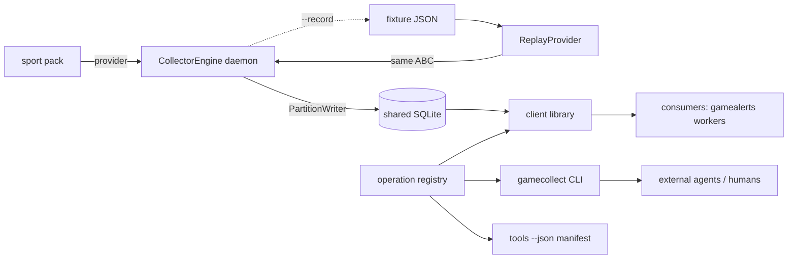
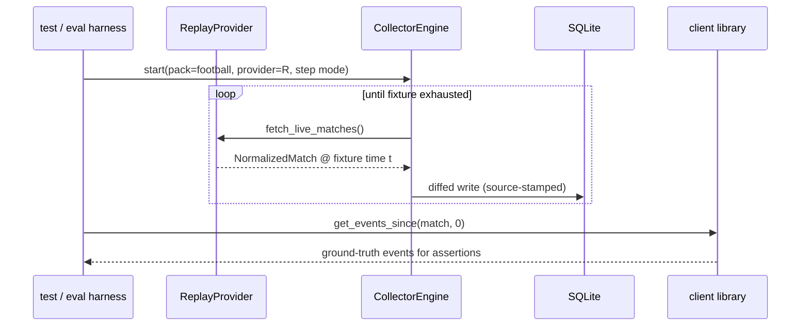

# Task: Collector interfaces — engine daemon, client library, gamecollect CLI, ReplayProvider + fixtures

**Status**: Not Started
**Component**: collector
**Assigned to**: Claude
**Priority**: High
**Branch**: feature/collector-interfaces
**Created**: 2026-07-02
**Completed**:

## Objective

On top of the foundation plan (`20260702-feature-collector-foundation.md` — scaffold, schema v1, pack SDK, football pack), build the pieces consumers touch: the collection engine daemon, the client library, the `gamecollect` CLI with its self-describing `tools --json` manifest, and `ReplayProvider` with seed fixtures imported from gamealerts' databases.

**Depends on:** the foundation plan being complete (schema v1, `PartitionWriter`, provider ABC, football pack). Do not start `/conduct` on this plan before the foundation plan's Progress section shows all phases done.

## Context

`docs/DESIGN.md` §6–7 define the interface contract: the client library is canonical; the CLI is a thin `main()` over it whose `--json` output schemas ARE the public contract; a manifest enables runtime capability discovery (chosen over MCP because MCP tool lists are not hot-reloaded in practice — consuming agents regenerate function-calling tool definitions from the manifest instead). `ReplayProvider` is a first-class provider, not test scaffolding: it is the eval/hardening harness for any consumer (gamealerts' game workers replay recorded matches and assert commentary behavior against ground truth).

Fixture ground truth (verified 2026-07-02 against the live DBs — note this corrects the DESIGN.md §7 fixture list's ambiguity about which DB holds what):
- Real DB (`~/.local/share/gamealerts/gamealerts.db`): Morocco–Haiti `espn:760464` 4–2 FINISHED, 21 events; New Zealand–Belgium `espn:760477` 1–5 FINISHED, 20 events; Turkey–USA `espn:760470` 3–2 FINISHED, 18 events. (Commentary rows exist but are NOT imported — prose is out of scope per DESIGN.md §3.)
- Fictional DB (`~/.local/share/gamealerts/gamealerts-fictional.db`): Canada–Qatar `2026-06-18_canada_vs_qatar_9` 6–0 FINISHED, 6 events (Jonathan David hat-trick — the context-awareness test case), 0 commentary rows. Its schema is older: `rosters` lacks `player_name_folded`, no `lineups` table — the importer must tolerate both shapes.

## Requirements

- Engine daemon: one process per tournament (source); load pack → poll provider → diff → write via `PartitionWriter`; ported/adapted from gamealerts `collector/session.py` poll-loop mechanics, minus everything prose/voice (`summarizer.py` is explicitly NOT ported).
- Client library: `list_matches`, `get_state`, `get_events_since(match_id, since_seq)`, `get_standings`, `get_squad`, `get_player_stats` — sync, typed returns, read-only, safe to call while daemons write (WAL). `match_id` is globally unique (the foundation plan source-qualifies unreconciled canonical ids), so the reader resolves `source` internally via the `matches` row — no `source` parameter leaks into the client API even though `events` is keyed `(source, match_id, seq)`.
- CLI `gamecollect`: argparse; every read subcommand has `--json`; `gamecollect tools --json` emits the manifest (subcommand names, args, output JSON Schemas) generated from the same registry the library exposes — the CLI cannot drift from the library by construction.
- `ReplayProvider(fixture, speed=1.0)`: implements the provider ABC; replays a recorded fixture with original or accelerated timing; `speed=inf` (or `step()` mode) for deterministic tests.
- Fixture format: JSON files checked into the repo (portable, diffable, no binary DBs in git) + an importer script that exports them from a gamealerts-schema SQLite file.
- Recording symmetry: the engine can write a replayable fixture of any live session (`--record` flag).

## Review Focus

- Manifest/CLI/library single-source-of-truth: verify the manifest is generated from the same registry that drives argparse wiring — a hand-maintained manifest is a finding.
- JSON output schema stability: these schemas are the public contract; verify they are versioned (manifest carries `contract_version`) and covered by golden-file tests.
- ReplayProvider determinism: with `speed=inf`/step mode, two runs over the same fixture must produce byte-identical DB content (modulo timestamps — pin or exclude them).
- Importer tolerance of the two known gamealerts schema shapes (fictional DB: no `player_name_folded`, no `lineups`).
- Engine failure posture: provider errors (`ProviderUnavailableError`, `ShapeDriftError`) must not wedge the poll loop; verify backoff and loud logging, mirroring gamealerts' collector behavior.

## Implementation Checklist

### Phase 1: Collection engine daemon

**Impl files:** `src/gamecollect/engine.py, src/gamecollect/diffing.py`
**Test files:** `tests/test_engine.py`
**Test command:** `uv run pytest tests/test_engine.py -q`

- `engine.py`: `CollectorEngine(pack, db_path, source, poll_interval)` — poll loop with jittered interval, provider-error backoff, graceful shutdown on SIGTERM; opens the DB with `connect(db_path, side_table_ddl=pack.side_table_ddl)` before constructing `PartitionWriter(conn, source, taxonomy=pack.taxonomy)` so pack side tables and taxonomy validation are active; adapted from gamealerts `collector/session.py` mechanics (no prose, no IPC).
- `diffing.py`: compute new events (by seq) and changed match state between polls so writes are minimal; port the diff discipline from gamealerts' session loop.
- Write-order constraint (from the foundation writer's adversarial-review fix): `append_events`/`map_provider_match` raise `UnseededMatchError` unless the match row already exists under this source — the engine must `upsert_match` (or `register_unreconciled_match(conn, writer, match)`, which seeds a qualified strip row and returns `None` when identity fields are missing) before appending that poll's events. A `str` return from `register_unreconciled_match` always names a seeded row; on `None` the engine skips child writes for that match.
- Re-poll drift constraint (from the /code-review fix): `append_events` raises `SequenceError` when a re-sent seq carries a different `type` than the stored row (positional seqs shifted, e.g. a VAR-overturned keyEvent removed). The engine's poll loop must treat this as provider drift for that match (log + skip or re-sync), not as a fatal daemon error.
- Tests: fake provider (scripted `NormalizedMatch` sequences) drives the engine against a temp DB; assert idempotent re-poll (no duplicate events), backoff on `ProviderUnavailableError`, clean shutdown.

### Phase 2: Client library

**Impl files:** `src/gamecollect/client.py, src/gamecollect/registry.py`
**Test files:** `tests/test_client.py`
**Test command:** `uv run pytest tests/test_client.py -q`

- `client.py`: the six read functions over `db/reader.py`, typed returns (dataclasses), read-only connections.
- `registry.py`: the operation registry — each operation declares name, params (name/type/required), summary, and output JSON Schema. Library functions are registered here; CLI and manifest are both generated from it.
- Tests: seed a temp DB via `PartitionWriter`, exercise every operation; `get_events_since` pagination/monotonicity; concurrent read-while-write under WAL.

### Phase 3: gamecollect CLI + tools manifest

**Impl files:** `src/gamecollect/cli.py`
**Test files:** `tests/test_cli.py, tests/golden/manifest.json, tests/golden/*.json`
**Test command:** `uv run pytest tests/test_cli.py -q`
**Validation cmd:** `uv run gamecollect tools --json | uv run python -m json.tool > /dev/null`

- `cli.py`: argparse subcommands generated from the operation registry (`matches`, `state`, `events`, `standings`, `squad`, `player-stats`) + `collect` (runs the engine: `--pack`, `--db`, `--source`, `--record`) + `tools --json`.
- Manifest: `{contract_version, operations: [{name, params, output_schema}]}` — emitted from the registry, never hand-written.
- Golden-file tests: manifest and one sample `--json` output per operation checked in; schema changes show up as reviewable diffs.

### Phase 4: ReplayProvider + fixture import

**Impl files:** `src/gamecollect/replay.py, src/gamecollect/fixture_io.py, scripts/import_gamealerts_fixtures.py, fixtures/football/*.json`
**Test files:** `tests/test_replay.py, tests/test_fixture_io.py`
**Test command:** `uv run pytest tests/test_replay.py tests/test_fixture_io.py -q`
**Validation cmd:** `uv run python scripts/import_gamealerts_fixtures.py --check fixtures/football`

- `fixture_io.py`: fixture JSON format — match header + ordered events with original timestamps/minutes + entities snapshot; `write_fixture`/`read_fixture`; format version field.
- `replay.py`: `ReplayProvider` implementing the ABC; wall-clock pacing by original event spacing scaled by `speed`; `step()` mode for tests; terminal state = FINISHED match.
- `scripts/import_gamealerts_fixtures.py`: reads a gamealerts-schema SQLite file (both known shapes: with/without `player_name_folded` and `lineups`), exports named matches to fixture JSON; `--check` validates existing fixtures parse and replay deterministically.
- Import and check in the four seed fixtures: `morocco-haiti-espn760464`, `nz-belgium-espn760477`, `turkey-usa-espn760470` (real DB), `canada-qatar-fictional` (fictional DB).
- End-to-end test: `CollectorEngine` + `ReplayProvider(canada-qatar, step mode)` → assert final DB state matches fixture ground truth (6 events, 6–0, David ×3).

## Technical Specifications

### Files to Modify
- `README.md` — usage section once the CLI exists (install, `gamecollect collect`, `gamecollect events --json`).
- `docs/DESIGN.md` — record the fixture-location correction (which DB holds which seed match) and the fixture JSON format reference.

### New Files to Create
- See per-phase **Impl files**; plus `fixtures/football/` (checked-in seed fixtures) and `scripts/`.

### Architecture Decisions
- **Operation registry as single source of truth**: library functions, argparse subcommands, and the manifest all derive from one registry — drift between CLI and library is impossible by construction, and a new operation is automatically discoverable via `tools --json` (the hot-reload property that motivated CLI-over-MCP).
- **Fixtures as JSON in git, not SQLite**: diffable, portable, schema-migration-proof; the importer bridges from live DBs.
- **Replay pacing in the provider, not the engine**: the engine polls identically against live and replay providers — replay is invisible to it, which is what makes replay a real end-to-end harness.
- **No commentary import**: fixtures carry facts only (events/state), per the data-plane boundary.

### Dependencies
- Runtime: still stdlib-only. Dev: unchanged (pytest, ruff).

### Integration Seams

| Seam | Writer (task) | Caller (task) | Contract |
|------|---------------|---------------|----------|
| operation registry | Phase 2 | Phase 3 CLI + manifest | Registry entry = (name, params, output schema, impl); CLI/manifest generated, never hand-edited |
| provider ABC | foundation plan | Phase 1 engine, Phase 4 replay | Engine consumes ABC only; replay indistinguishable from live |
| connection setup | foundation plan `connect(path, *, side_table_ddl=())` | Phase 1 engine | Engine passes the loaded pack's `side_table_ddl`; core schema/migrations still run before pack side-table DDL |
| fixture format | Phase 4 `fixture_io` | Phase 4 importer + replay; gamealerts eval harness (external) | Versioned JSON: header + ordered timed events + entities; facts only |
| `--record` output | Phase 1 engine flag | Phase 4 `fixture_io` | Recording a live session yields a fixture `read_fixture` accepts |
| JSON output schemas | Phase 3 golden files | external consumers (gamealerts workers, third parties) | Breaking change ⇒ `contract_version` bump + golden diff in review |

## Architecture & Call Flow

> Same topology as the foundation plan's diagram (see `20260702-feature-collector-foundation.md`); this plan builds the dashed components. Sequence below shows the two consumer paths this plan enables.

Component graph — consumer paths built here:

Trigger order — replay-driven end-to-end run (the eval harness path):

Context lifecycle:

| Step | Trigger | Enters context | Cleared/persisted | Turn boundary |
|------|---------|----------------|-------------------|---------------|
| 1 | `gamecollect collect` | pack, provider (live or replay), source, DB path | engine state persists for process life | process lifetime |
| 2 | poll/step tick | provider snapshot | discarded after diff+write | per tick |
| 3 | `--record` | normalized snapshots | appended to fixture JSON (durable) | per session |
| 4 | CLI read invocation | argv → registry op → DB query | result to stdout; nothing retained | per invocation |
| 5 | `tools --json` | registry | manifest to stdout | per invocation |

## Testing Notes

### Test Approach
- [ ] Engine loop against scripted fake provider (temp DB, no network)
- [ ] Client library ops against seeded temp DB; read-while-write under WAL
- [ ] CLI golden-file tests (manifest + per-op sample output)
- [ ] Replay determinism: same fixture twice ⇒ identical DB content (timestamps pinned)
- [ ] End-to-end: replay canada-qatar fixture through the real engine, assert ground truth via client library
- [ ] Importer against both known gamealerts schema shapes

### Test Results
- [ ] All tests pass (`uv run pytest -q`)
- [ ] Lint clean; CI green

### Edge Cases Tested
- [ ] Provider unavailable mid-run → backoff, loop survives
- [ ] `get_events_since` with `since_seq` beyond head → empty list, not error
- [ ] Fixture with zero events (scheduled match) → replay terminates cleanly
- [ ] Record-then-replay round trip equals original fixture

## Acceptance Criteria

- `gamecollect collect --pack football-wc2026 --db /tmp/x.db --source test` runs against `ReplayProvider` and populates the DB; every read op then returns correct `--json` output.
- `gamecollect tools --json` validates as JSON and lists every read operation with output schemas; golden files match.
- Four seed fixtures checked in and `--check`-clean; canada-qatar end-to-end test asserts 6 events / 6–0 / David ×3.
- Record→replay round trip proven by test.
- Tests passing, code reviewed, README + DESIGN.md updated.

<!-- /review-plan writes the marker line above. Everything below is the workspace: edits here do NOT invalidate the marker. -->

## Progress

- [ ] Phase 1: Collection engine daemon
- [ ] Phase 2: Client library
- [ ] Phase 3: gamecollect CLI + tools manifest
- [ ] Phase 4: ReplayProvider + fixture import

## Findings

- (append findings here as work proceeds)

## Issues & Solutions

- (none yet)

## Final Results

(fill when complete)
