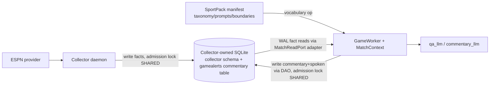
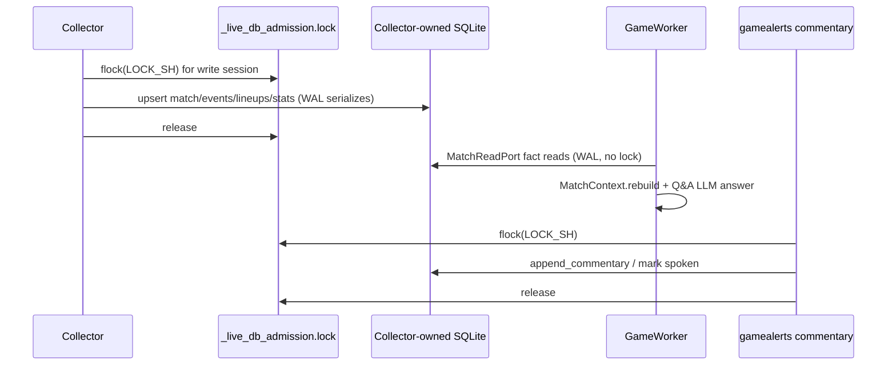

# Task: GameWorker integration — generic read Protocol, shared-file write model, pack-manifest vocabulary

**Status**: Complete
**Component**: collector
**Assigned to**: Claude
**Priority**: High
**Branch**: feature/gameworker-integration (off `main`, after PR #2 merges)
**Created**: 2026-07-07

## Objective

Let the gamealerts **GameWorker** (intelligence plane, PR #33 `feature/game-worker`) answer complex live/historical match questions by consuming the collector's data through a **generic, sport-agnostic contract** — without the collector adopting gamealerts' football schema. Three collector-side deliverables:

1. A **generic read Protocol** plus a collector-backed adapter satisfying the ~10-method read surface the worker needs, over the collector's own sport-agnostic schema.
2. A **single collector-owned file write model**: a `data_dir` resolver so both processes open the same SQLite file, with the **collector creating and stamping the file first**. Writes are serialized by SQLite WAL + `busy_timeout=5000`; a SHARED `_live_db_admission.lock` (gamealerts' existing primitive) is adopted as forward-scaffolding to fence a future destructive collector-side reset — it is not a per-write mutex.
3. Exposing the **pack manifest** (`SportPack.taxonomy` display names/importance + `prompt_fragments` + `compaction_boundaries`) as the worker's sport-vocabulary source, so its rendering/phase logic becomes data-driven instead of football literals.

## Context

The gamealerts app could not answer *"Who scored in that game?"* — it routed factual questions to a `recent_commentary` tool that returned prose or nothing. The answer lives in **structured goal events with scorer names**, which the collector already normalizes. PR #33 fixed the routing half on the gamealerts side (`MatchContext` + a Q&A LLM that dispatches structured tools), but it reads from a **concrete football `DAO`** and hardcodes a two-team model and football event vocabulary. The user's direction is explicit: **no schema lock-in** — every sport has participants, a score, a roster, commentary, and *some* phase model (halves/sets/sessions/quarters/periods/innings/overtime); an LLM reasons over generic data. The collector may be 1:1 with a tournament internally, but its **exposed API must be generic**.

Investigation this session established:
- The worker's de-facto read surface is 10 read-only methods (`latest_state`, `events_for_match`, `lineup_for_match`, `lineup_for_match_live`, `venue_for_match`, `roster_for_team`, `roster_contains`, `player_in_lineup`, `lineup_team_announced`, `recent_commentary`); event *shape* is generic (`type/minute/player/team/detail/assist`) but the `type` vocabulary and two-team columns are football-coupled in the worker's Python logic.
- The collector is the natural home for the missing sport vocabulary: `SportPack.taxonomy`/`prompt_fragments`/`compaction_boundaries` are exactly what the worker hardcodes.

This plan is the **collector half** of a two-repo change; the gamealerts half is flagged under Integration Seams as coordination items, not implemented here.

## Requirements

- The collector must **not** adopt gamealerts' 8-table football schema. The shared store uses the collector's sport-agnostic schema (`schema_meta`/`matches`/`events`/`entities`/`standings`/`provider_match_map` + pack side tables).
- Read contract shapes must be designed to **generalize** (a `participants` list, not `team1`/`team2`; a `phase` field/boundary set, not a `half_time` literal) even if WC2026 ships a football profile first.
- One collector-owned SQLite file, opened **identically** by both processes (WAL, `busy_timeout=5000`, `foreign_keys=ON` — already the collector's PRAGMAs, `connection.py:52-62`). **The collector creates + stamps the file (`connect()` → `schema_meta`) before gamealerts opens it**, so `open_reader`'s version gate (`reader.py:69-73`) and the `commentary → matches(match_id)` FK both have their prerequisites. Writes are serialized by SQLite WAL + `busy_timeout`, not an app mutex; many concurrent readers via WAL.
- The collector **never writes commentary** (DESIGN.md: prose belongs to consuming apps, `schema.sql:13-14`). Commentary must be readable through the contract, and the adapter must **tolerate an absent `commentary` table** (return empty) since gamealerts creates it lazily on first write — a collector-first boot / pre-match / replay has no such table yet.
- Core collector runtime deps stay minimal (`pyproject.toml`: `dependencies = []`); `fcntl` is stdlib. No new third-party runtime dep.
- Backwards compatibility: existing `connect(path, …)` callers, `PartitionWriter`, and the versioned `schema_meta` gate (`migrations.py:39-40`, `SCHEMA_MAJOR=1`) must keep working; the shared-file path is additive.

## Review Focus

- **Lock semantics — RESOLVED from gamealerts source (2026-07-08).** `_main_loop.pid` **is** a lifetime-held singleton: `MainLoop` holds it `AdvisoryLock`/`LOCK_EX` for its entire run (`gamealerts/locks.py:57-117`, `store/maintenance.py:21-49` invariant 1), so a collector can never acquire it per-write — the plan must NOT reuse it. gamealerts already ships the admission primitive this plan was reaching for: **`_live_db_admission.lock`** (`locks.py:152-174`), acquired **SHARED** by every live-DB writer for its whole write session and **EXCLUSIVE** only by the destructive `reset_live`. Shared holders coexist (they do NOT block one another); the exclusion is solely a reset-fence. **Adopt this existing convention verbatim** rather than inventing `_write.lock`.
- **Lock hold duration — CORRECTED.** The prior "hold-for-lifetime starves commentary" concern assumed an EXCLUSIVE per-batch mutex, which is NOT gamealerts' model. The admission lock is SHARED — held for the whole writer session without blocking other writers; actual write serialization is SQLite **WAL + `busy_timeout=5000`** at the transaction level (`db.py:42-51`), not an app mutex. A shared admission lock held for the collector's session is correct and starves nothing. A separate **per-resource EXCLUSIVE** lock (gamealerts uses `{match_id}.pid` / `_global_scoreboard.pid` under `{data_dir}/locks/`) prevents two writers dual-writing the *same* resource.
- **File model DECIDED — single collector-owned file, strict per-table ownership** (see Findings; confirmed with gamealerts side 2026-07-08). `reset_live` unlinks `gamealerts.db` by literal name (`maintenance.py:82,387-395`), so the collector's file is never a reset target — the whole-file-unlink hazard applies only to co-tenancy *inside gamealerts.db*, which we are not doing. Verify at review: the collector's `schema_meta` gate keys only on the `schema_meta` version and tolerates gamealerts' `commentary` table (confirmed `migrations.py:106-116`).
- **Commentary hosting** — gamealerts owns exactly one table (`commentary`) in the collector's file and applies ONLY its scoped DDL (not full `schema.sql`). Verify at review: no gamealerts pollution tables created; fact reads never routed through gamealerts' DAO.
- **Read shape genericity** — audit that no football column name (`team1`/`team2`, `score_home`/`away`, `formation`) leaks into the generic Protocol's *type signatures*; football specifics belong only in the football-profile adapter's *values*. This invariant must be **tested** (structural `Protocol`-satisfaction does NOT catch a polluted signature) — a source/AST or grep assertion over `readport.py`.
- **File-bootstrap ordering** — the admission lock fences nothing today (no EXCLUSIVE user exists on the collector's file; `reset_live` only fences `gamealerts.db`). Verify at review the plan is honest that the SHARED lock is forward-scaffolding for a future collector-side destructive reset, and that startup ordering (collector creates+stamps first) is stated as a constraint, not left implicit.
- **Squad-roster source** — Phase 2's team-level roster commits to the static `worldcup.squads.json` (there is no ESPN team-squad fetch; the ESPN `rosters[]` block is per-match and already becomes `football_lineups`). Verify the loader is actually wired (the fixture is presently consumed by no code).

## Implementation Checklist

### Phase 1: Shared-store access model — data_dir resolver + admission lock

**Impl files:** `src/gamecollect/db/connection.py, src/gamecollect/db/locking.py (new), src/gamecollect/db/paths.py (new)`
**Test files:** `tests/test_db_locking.py, tests/test_db_paths.py`
**Test command:** `uv run pytest tests/test_db_locking.py tests/test_db_paths.py -q`

- `paths.py`: `resolve_data_dir(explicit=None)` and a db-path helper for the **collector-owned** file (its own filename, NOT `gamealerts.db`) honoring a documented env var + default dir; keep the existing explicit-`path` form of `connect()` working unchanged. The lock dir is `<data_dir>/locks/` (mirrors gamealerts).
- `locking.py`: mirror gamealerts' `AdvisoryLock`/`live_db_admission_lock` semantics (`fcntl.flock`): a **SHARED** admission lock (`_live_db_admission.lock`) held for a writer's session — many shared writers coexist, EXCLUSIVE reserved for destructive maintenance. **Forward-scaffolding note:** no EXCLUSIVE user exists on the collector's file yet (`reset_live` only fences `gamealerts.db`); the SHARED lock is built now so gamealerts' commentary writes and the collector agree on the primitive, and a *future* collector-side destructive reset (the named EXCLUSIVE user) can correctly fence in-flight writers. Actual write serialization is SQLite WAL + `busy_timeout=5000`, not this lock. Readers never lock. A per-resource EXCLUSIVE `.pid` lock is **optional** — WAL + the single-`PartitionWriter`-per-source topology already prevents same-resource dual-writes; add it only if two collector daemons on one match becomes a real scenario.
- Tests: two connections to one temp file; a SHARED writer does not block another SHARED writer; an **EXCLUSIVE holder blocks a new SHARED acquire** (the reset-fence direction — the whole point of the lock) and vice-versa; a reader sees committed rows via WAL without blocking; env-var and default-dir resolution; explicit-path back-compat.

### Phase 2: Durable rich data for the read surface — venue + roster (+ commentary hosting)

**Impl files:** `src/gamecollect_football/pack.py, src/gamecollect_football/espn.py, src/gamecollect_football/operations.py`
**Test files:** `tests/football/test_side_tables_venue_roster.py, tests/test_consumer_ddl.py`
**Test command:** `uv run pytest tests/football/test_side_tables_venue_roster.py tests/test_consumer_ddl.py -q`

- Capture + persist the data the read surface needs that is not stored today: **venue** (ESPN summary/scoreboard carries stadium/city — currently only in scoreboard `payload`; make it durable) and **squad roster** (team-level, distinct from per-match `football_lineups`). **Squad source is the static `worldcup.squads.json`** — there is NO ESPN team-squad fetch (the ESPN `rosters[]` block is per-match and already becomes `football_lineups`); this phase must **wire the loader**, since the fixture is presently consumed by no code. Add football side tables (e.g. `football_venue`, `football_roster`) via `side_table_ddl`, following the existing `football_lineups`/`football_stats` pattern (`pack.py:38-76`).
- **Commentary hosting (DECIDED):** gamealerts owns + applies its OWN scoped `commentary` `CREATE IF NOT EXISTS` through its own connection (not the collector's `side_table_ddl` seam, and NOT its full `schema.sql`). The collector's only obligation is to tolerate the foreign table — already confirmed: the `schema_meta` gate keys solely on the version row (`migrations.py:106-116`). Collector never reads or writes `commentary`. This phase adds a regression test asserting that tolerance; no collector code change for commentary.
- Tests: adapter-visible venue/roster rows after a summary poll; a gamealerts-style `commentary` table (with its `match_id → matches(match_id)` FK) coexists with the collector schema, does not trip the `schema_meta` gate, and the collector's writers/reader ignore it. **After a full collector write cycle, assert the file contains NONE of the gamealerts pollution tables (`stadiums`/`stats`/`rosters`/`lineups`) and zero `commentary` rows** (the collector-side half of the "collector writes zero commentary" AC).

### Phase 3: Generic read Protocol + collector-backed adapter

**Impl files:** `src/gamecollect/readport.py (new), src/gamecollect_football/readport.py (new), src/gamecollect/db/reader.py`
**Test files:** `tests/test_readport_contract.py, tests/football/test_football_readport.py`
**Test command:** `uv run pytest tests/test_readport_contract.py tests/football/test_football_readport.py -q`

- `readport.py` (**core**): a generic `MatchReadPort` `Protocol` (typing-only, structural) with sport-neutral methods and return shapes — `participants` list (name/side/score) not `team1/team2`; events carry a `phase` field; lineup/roster keyed by participant. Document the mapping from the worker's current 10 football method names to this Protocol.
- `src/gamecollect_football/readport.py` (**in the pack, NOT core** — preserves the pack→core dependency direction): a concrete football adapter implementing the surface over the collector's reader/client + football side tables + pack ops (`reader.get_state`/`get_events_since`/`get_standings`, squad op, new venue/roster reads, consumer commentary table). Returns plain dicts/lists (the shapes `MatchContext`/Q&A tools consume). **Tolerates an absent `commentary` table** (returns `[]`, mirroring the pre-match venue/roster `None`/empty case).
- Add any missing reader helpers (`reader.py`) rather than raw SQL in the adapter.
- Tests: contract test asserts the adapter satisfies `MatchReadPort` (structural) and every method returns the documented shape over a seeded temp DB; a **source/AST or grep test asserting `readport.py`'s method signatures contain none of the football literals** (`team1`/`team2`/`score_home`/`score_away`/`formation`) — structural satisfaction alone does not catch a polluted Protocol signature; the adapter tolerates an absent `commentary` table; football-profile values for the three knockout scenarios (regulation / AET / penalties) already committed as fixtures.

### Phase 4: Pack-manifest vocabulary operation

**Impl files:** `src/gamecollect/registry.py, src/gamecollect/client.py, src/gamecollect/cli.py, src/gamecollect/packs/spec.py`
**Test files:** `tests/test_vocabulary_op.py, tests/golden/vocabulary_football.json`
**Test command:** `uv run pytest tests/test_vocabulary_op.py -q`

- New read operation `vocabulary` (registry `Operation`, `registry.py:101-137`) returning the pack manifest an LLM needs: `taxonomy` (event type → `display_name`, `importance_default`), `prompt_fragments`, `display_metadata`, and **`compaction_boundaries`** (the generic phase-boundary set — the data-driven replacement for the worker's `half_time` literal).
- Expose via client + CLI + `tools --json` manifest (carries `contract_version`), matching the existing core-op wiring.
- Tests: `vocabulary` op returns the football pack's taxonomy/prompts/boundaries; golden file; contract_version present.

### Phase 5: Integration validation, docs, cross-repo contract

**Impl files:** `docs/DESIGN.md, AGENTS.md, README.md, docs/integration/gameworker-contract.md (new)`
**Test files:** `tests/test_integration_shared_file.py`
**Test command:** `uv run pytest tests/test_integration_shared_file.py -q`

- End-to-end: collector writes facts to a shared temp file under the admission lock; a stub reader uses `football_readport` + `vocabulary` to answer "who scored / lineup / venue"; a second "commentary writer" writes under the lock; assert no corruption and WAL reads observe both.
- Document the cross-repo contract (`docs/integration/gameworker-contract.md`): the `MatchReadPort` methods + shapes, the lock protocol + lock file, the `data_dir`/env convention, the startup-ordering constraint, and the commentary-hosting decision. Update DESIGN.md's data-plane boundary and README.
- **Companion gamealerts-side plan:** the 7 Integration Seams are the gamealerts repo's work list and belong in a **separate dev plan in that repo** (owned by the gamealerts side), not implemented here. This collector plan is complete when the contract doc + seams table give that plan everything it needs (Protocol shapes, lock/ordering rules, config + `clear_commentary` additions).

## Technical Specifications

### Files to Modify
- `src/gamecollect/db/connection.py:33-61` — add optional `data_dir`-resolved open path; keep explicit-path form. (NO consumer-DDL-seam change — gamealerts applies its own scoped `commentary` DDL through its own connection; the existing `side_table_ddl` already covers the collector's own venue/roster tables.)
- `src/gamecollect/db/reader.py:36-224` — add read helpers for venue/roster/lineup/commentary backing the adapter (no raw SQL in the adapter).
- `src/gamecollect/registry.py:238-286` — register the `vocabulary` op alongside the 4 core ops.
- `src/gamecollect/client.py:159-188` — add the vocabulary read method.
- `src/gamecollect/cli.py` — surface `vocabulary` in the CLI + manifest.
- `src/gamecollect_football/pack.py:38-76,395-457` — new venue/roster side-table DDL + wiring.
- `src/gamecollect_football/espn.py` — durably capture venue + roster from the summary.
- `src/gamecollect_football/operations.py:242` — pack ops for venue/roster reads if exposed as ops.

### New Files to Create
- `src/gamecollect/db/paths.py` — `data_dir`/env resolver.
- `src/gamecollect/db/locking.py` — `fcntl.flock` SHARED admission lock (forward-scaffolding).
- `src/gamecollect/readport.py` — generic `MatchReadPort` Protocol (core, sport-neutral).
- `src/gamecollect_football/readport.py` — concrete football adapter (in the pack, not core, per pack→core layering).
- `docs/integration/gameworker-contract.md` — the cross-repo contract doc.

### Architecture Decisions
- **Single file, owned by the collector, strict per-table ownership** (confirmed with gamealerts side 2026-07-08). The collector writes only its fact tables; gamealerts writes only its own tables and reads facts through the adapter. No genuinely shared (co-written) table exists. gamealerts' GameWorker is *verified* read-only on fact tables (no `dao.` write calls in `game_worker.py`; `MatchContext` only reads) — but the DAO retains fact-write methods (`upsert_match`/`upsert_rosters`/`upsert_stadiums`), so read-only-on-the-shared-file is a **discipline enforced by Integration Seams #1/#4, not a structural guarantee the collector can enforce**. `reset_live` is a non-issue: it targets `gamealerts.db` by literal filename, which this file is not.
- **Collector creates + stamps the file before gamealerts opens it (startup ordering).** `open_reader` raises `SchemaVersionError` on an unstamped `schema_meta` (`reader.py:69-73`), and gamealerts' scoped-`commentary` DDL does NOT stamp it; the `commentary → matches` FK (with `foreign_keys=ON`) also requires `matches` to exist. So the collector must `connect()` (create + stamp + create `matches`) first. This is a hard ordering constraint, surfaced as an Integration Seam, not left implicit.
- **Collector schema is authoritative; gamealerts reads via the adapter.** No football schema in the collector; the worker's football assumptions move behind the adapter (values) and the Protocol stays sport-neutral (types). **Hard rule:** the GameWorker reads facts ONLY via the `MatchReadPort` adapter, NEVER gamealerts' concrete `DAO` fact methods (those SELECT `team1`/`team2`/… columns that do not exist on the collector's tables). gamealerts' `DAO` is used against this file ONLY for commentary (`append_commentary`/`mark_spoken`/`recent_commentary`).
- **Commentary is gamealerts' ONLY owned table in the file** (confirmed: no `spoken_flags` — `spoken` is a column on `commentary`; no `MatchContext` cache — it is rebuilt in-memory from fact tables; no `user_prefs` — config/env). gamealerts applies **only its scoped `commentary` DDL** — NOT its full `schema.sql`, which would (a) no-op-collide on 4 same-named/different-shape collector tables (`matches`/`events`/`standings`/`provider_match_map`) and (b) pollute the file with 4 empty gamealerts-only tables (`stadiums`/`stats`/`rosters`/`lineups`). The commentary FK `match_id → matches(match_id)` is valid as-is: the collector's `matches.match_id` is `TEXT PRIMARY KEY` (implies commentary is writable only after the collector persists the match — natural ordering).
- **Adopt gamealerts' existing lock convention** (resolved from source 2026-07-08): a **SHARED** `_live_db_admission.lock` under `{collector_data_dir}/locks/`, held for a writer's session; write serialization itself is SQLite WAL + `busy_timeout=5000`, not an app mutex. Do NOT reuse `_main_loop.pid` (lifetime singleton) and do NOT invent `_write.lock`. **Forward-scaffolding, honestly scoped:** no EXCLUSIVE user exists on the collector's file today — `reset_live` fences only `gamealerts.db` (`maintenance.py:259`, literal name), never this file. The SHARED lock is built now so (a) the collector and gamealerts share one primitive on this file, and (b) a *future* collector-side destructive reset/`clear_commentary` (the named EXCLUSIVE user) can correctly fence in-flight SHARED writers. Until that op exists the lock excludes nothing; that is acceptable as scaffolding but must not be described as active fencing. The per-resource `.pid` EXCLUSIVE lock is **optional** — WAL + single-`PartitionWriter`-per-source already prevents same-resource dual-writes; add only if two collector daemons on one match becomes real.
- **`compaction_boundaries` is the generic phase signal.** Exposing it via `vocabulary` lets the worker drive phase compaction data-driven, replacing the `event_type == "half_time"` literal.

### Dependencies
- `pyproject.toml`: core `dependencies = []` unchanged; `fcntl` is stdlib (POSIX — document the platform assumption; the collector already targets `darwin`/Linux). `requires-python = ">=3.11"`.

### Integration Seams (cross-repo — gamealerts side, NOT implemented here)
| # | gamealerts-side change required | Why |
|---|---|---|
| 1 | For fact reads, type the worker's `dao` param as the `MatchReadPort` **Protocol** and inject the collector adapter; keep the concrete `DAO` only for commentary writes on the shared file | Decouples fact reads from gamealerts' football store; its DAO can't read the collector's schema |
| 2 | Make `MatchContext`/FastLine **data-driven** over pack-supplied vocabulary (`taxonomy` display names + `prompt_fragments`) instead of literal `goal`/`card`/… dispatch | Multi-sport rendering |
| 3 | Generalize two-team (`team1`/`team2`/`score_home`/`away`) → `participants`; `half_time` literal → `compaction_boundaries`/`phase` | No schema lock-in |
| 4 | Apply **only the scoped `commentary` DDL** to the collector's file (NOT full `schema.sql`); hold `_live_db_admission.lock` **SHARED** (via the already-parameterized `live_db_admission_lock(collector_data_dir/"locks")`) for `append_commentary`/`mark_spoken` | Avoid table-name collisions + pollution; correct shared-writer fencing |
| 5 | Add a `GAMEALERTS_COLLECTOR_DATA_DIR` config value so gamealerts learns the collector's file + `locks/` path at startup | Both processes must open the same file / lock dir |
| 6 | Add a scoped `clear_commentary(match_id)` (or table-level clear) DAO/maintenance path | `reset_live` won't reach the collector's file, so replay/demo needs an explicit commentary clear |
| 7 | Open the collector's file only **after** it exists + is stamped (retry/degrade if absent); never create it via gamealerts' full `_apply_schema` — apply only the scoped `commentary` DDL | The collector must create+stamp `schema_meta` and `matches` first (FK + version-gate prerequisites); a gamealerts-first `connect()` would leave the file unstamped and pollute it |

## Architecture & Call Flow

Three independently-executing components: the **collector daemon** (writer of facts), the **gamealerts GameWorker + commentary writer** (reader + writer of prose), and the **shared SQLite file**.

_(EXCLUSIVE on the admission lock is reserved for a destructive reset; SHARED writers coexist and are serialized at the row level by SQLite WAL + `busy_timeout=5000`.)_

| Step | Trigger | Enters context | Cleared/persisted | Turn boundary |
|---|---|---|---|---|
| Poll-write | Collector engine tick | `NormalizedMatch` (facts + payload) | Persisted to collector-owned file; SHARED admission lock held for the write session | Per poll |
| Read | Worker Q&A / event | Adapter dicts (state/events/lineup/venue/commentary) | Read-only (WAL), nothing persisted | Per question / per event |
| Vocabulary | Worker init per sport | Pack manifest (taxonomy/prompts/boundaries) | Read-only, cached by worker | Once per match/sport |
| Commentary-write | gamealerts LLM output | Commentary text + `spoken` flag | Persisted to gamealerts-owned `commentary` table; SHARED admission lock | Per generated line |

## Testing Notes

### Test Approach
- Unit: path resolver, lock context manager (concurrent-writer serialization via two connections + WAL read-through), adapter shape contract over a `PartitionWriter`-seeded temp DB, vocabulary op golden.
- Integration: one shared temp file exercised by a writer thread (collector facts) + a commentary writer + an adapter reader concurrently; assert no corruption, both writers' rows visible, reads never block.
- Reuse the three committed knockout fixtures (regulation/AET/penalties) to assert the football-profile adapter returns correct scorer/lineup/`result_type` shapes.

### Test Results
- (pending)

### Edge Cases Tested
- Two writers contending; reader mid-write sees last committed WAL state.
- EXCLUSIVE admission holder blocks a new SHARED acquire (reset-fence direction) and vice-versa.
- Consumer commentary table present → collector `schema_meta` gate still opens the file.
- **Absent `commentary` table (collector-first boot / pre-match / replay) → adapter returns empty, not `no such table`.**
- Missing venue/roster (pre-match) → adapter returns `None`/empty, not an error.
- After a full collector write cycle → no gamealerts pollution tables (`stadiums`/`stats`/`rosters`/`lineups`), zero `commentary` rows.

## Acceptance Criteria

- [x] The collector creates + stamps the file first; both processes then open it via the shared `data_dir`/env convention; explicit-path `connect()` still works.
- [x] Writes are serialized by SQLite WAL + `busy_timeout`; the SHARED admission lock is present and its EXCLUSIVE-fences-SHARED direction is tested; concurrent reads via WAL never block; no corruption in the integration test.
- [x] A `MatchReadPort` adapter (in `gamecollect_football`, not core) satisfies the worker's 10-method surface with generically-shaped returns, validated over seeded data + the knockout fixtures; the adapter tolerates an absent `commentary` table.
- [x] The generic `readport.py` Protocol carries **no football column names in its type signatures** — asserted by a source/AST/grep test.
- [x] `vocabulary` op returns the football pack's taxonomy/prompts/`compaction_boundaries`; exposed in client, CLI, and `tools --json` manifest.
- [x] Collector writes zero `commentary` rows and creates no gamealerts pollution tables (tested); commentary is readable through the contract when present.
- [x] Cross-repo contract doc committed; DESIGN.md/README/AGENTS updated; the 7 Integration Seams are written up for the gamealerts side.
- [x] Full suite + both CI lint gates green.

<!-- reviewed: 2026-07-08 @ 3c367820ad58712a0dade1d21463a001ad8dee7e -->

## Progress

- [x] Phase 1: Shared-store access model — data_dir resolver + admission lock (`10ac069`)
- [x] Phase 2: Durable rich data for the read surface — venue + roster (`bb42bf7`)
- [x] Phase 3: Generic read Protocol + collector-backed adapter (`6cdc00d`)
- [x] Phase 4: Pack-manifest vocabulary operation (`5a43eeb`)
- [x] Phase 5: Integration validation, docs, cross-repo contract (`5af0fcd`)

## Findings

- **Lock/data_dir ground truth resolved from gamealerts source (2026-07-08).** Read `gamealerts/locks.py`, `config.py`, `store/maintenance.py`, `store/db.py` directly (no second-agent inference needed).
  - `_main_loop.pid` and `_global_scoreboard.pid` are **lifetime-held EXCLUSIVE singletons**; per-match `CollectorSession`s hold `{match_id}.pid` EXCLUSIVE for the session — all under `{data_dir}/locks/`.
  - `_live_db_admission.lock` is the **SHARED admission gate** (`locks.py:152-174`): live-DB writers hold it SHARED for their whole run; `reset_live` takes it EXCLUSIVE. Shared holders coexist — this is a reset-fence, not a write mutex. **This is the primitive the plan should adopt; the invented `_write.lock` is dropped.**
  - Paths (`config.py:35-43,154-165`): `GAMEALERTS_DATA_DIR` → else `~/.local/share/gamealerts/`; live DB `gamealerts.db`, fictional `gamealerts-fictional.db`, lock dir `{data_dir}/locks/`.
  - Connection discipline (`db.py:42-51`): WAL + `busy_timeout=5000` + `foreign_keys=ON`, idempotent schema apply — matches the collector's own PRAGMAs.
- **`reset_live` is a whole-file unlink** (`maintenance.py:387-395`) whose row-count gate sees only gamealerts' 8 native tables. This is why co-tenancy must NOT be inside `gamealerts.db`.
- **File model DECIDED (2026-07-08): single file, owned by the collector, strict per-table ownership.** `reset_live` targets `gamealerts.db` by literal name so it never touches the collector's file — the hazard dissolves. Confirmed by the gamealerts-side Claude:
  - **No co-write risk.** gamealerts writes ONLY `commentary` (+ flips `commentary.spoken`); the GameWorker is read-only on all fact tables. Design (b) — read facts, own only commentary — is the actual current design.
  - **gamealerts' footprint is exactly one table: `commentary`.** No `spoken_flags` (column on commentary), no `MatchContext` cache (in-memory `rebuild`), no `user_prefs` (config/env).
  - **`live_db_admission_lock(lock_dir)` is already parameterized** — gamealerts points it at the collector's `locks/` dir and acquires SHARED for commentary writes. No lock code change.
  - **GameWorker is injection-based** (`build_game_worker(..., dao, ...)`) — no hard-coded DB path.
- **FK verified (this side):** `commentary.match_id → matches(match_id)` is satisfiable against the collector's `matches.match_id TEXT PRIMARY KEY`. No FK rework.
- **Q4 refinement (surfaced this side):** gamealerts must apply ONLY its scoped `commentary` DDL, not full `schema.sql` — else 4 same-name/different-shape collisions (no-op but fragile) + 4 empty pollution tables (`stadiums`/`stats`/`rosters`/`lineups`) land in the collector's file. And fact reads go ONLY through `MatchReadPort`, never gamealerts' DAO fact methods.
- **Two new gamealerts-side seams** (added to Integration Seams #5/#6): `GAMEALERTS_COLLECTOR_DATA_DIR` config; a scoped `clear_commentary(match_id)` (reset_live no longer clears commentary implicitly).

## Issues & Solutions

- **Cross-directory test imports broke outside full-suite collection order.** Two subagent-authored test files (`tests/test_readport_contract.py` in Phase 3, `tests/test_vocabulary_op.py` in Phase 4) imported helpers from sibling test files/directories without proper path setup (`tests.test_cli` treated as a package that doesn't exist; `tests/football/_football_helpers` imported cross-directory without a `sys.path` addition). Both passed when run as part of the full suite (collection-order side effects) but failed standalone. Fixed with the repo's existing same-directory-import convention (`from test_cli import ...`) and an explicit `sys.path.insert` for the one genuinely cross-directory case, then verified both standalone and combined.
- **Adding the `vocabulary` op broke 5 pre-existing tests hardcoding the exact 4-core-op set.** A legitimate blast-radius hit from Phase 4, not a workaround target — fixed by updating each assertion (4 in `tests/test_cli.py`, 1 renamed+updated in `tests/test_client.py`) to include `vocabulary`.
- **Phase 5's integration test caught a real event-payload seeding bug.** The Phase 5 test-writer's fixture-seeding helper stamped every event's participant name under the generic `player` payload key, but the real write path (`gamecollect.engine._event_to_row`/`_participant_key`) stamps goal-family events (`goal`/`own_goal`) under `scorer` instead — a distinction `FootballReadPort` relies on when reading events back. Earlier phases' simplified test helpers (Phase 3's `seeded_db` fixture) never asserted a specific scorer name, so the gap was invisible until Phase 5's end-to-end "who scored" assertion. Fixed by seeding through the real `_event_to_row` instead of a hand-rolled re-derivation.
- A `phase4-tests` subagent run hit a mid-response API connection error but had already written complete, correct files before crashing; verified and used them directly rather than respawning.

### Post-completion review-gauntlet hardening (2026-07-09 – 2026-07-17)

Three review-gauntlet rounds ran against the completed 5-phase branch and found real bugs beyond the phases' own tests, all fixed on this branch:

- **Team-name canonicalization gap swept across read AND write paths.** The first round's fix applied fold-based (casefold + diacritic-strip) team-name matching only to `football_lineups`. A full-diff re-review in the second round caught the identical gap in `football_roster` and `football_stats`, on both their read paths (comparisons against a stored/query name) and write paths (the value actually persisted) — an alias-dict lookup is brittle against the same name arriving with different casing/accents from different ESPN payload shapes, so every side-table team-name touch point now goes through the same `fold()` comparison rather than each having its own hand-rolled check. Lesson: a canonicalization fix scoped to "the table that failed" needs a follow-up grep across every other table sharing the same key, not just the one the reviewer's fixture happened to exercise.
- **Hand-maintained migratable-side-table list replaced with a structural derivation.** The set of side tables eligible for migration during stub adoption was a manually-updated list that had already caused one data-loss bug (a table added to `pack.py` but never added to the list silently failed to migrate, e.g. `football_venue` rows dropped during stub adoption — fixed in `168e3eb`). The list is now derived structurally from `SideTableSpec` tags (`_MIGRATABLE_SIDE_TABLES`), so adding a new side table can no longer silently omit itself from migration.
- **Phase-marker lookup got a real covering index.** `get_latest_event_of_type` (the per-poll hot path for the last phase-marker event) was doing a full per-match event scan; a targeted per-type-seek query plus a new covering index (`idx_events_match_type_seq`, with a `schema_meta` minor-version bump) replaced it, confirmed via `EXPLAIN QUERY PLAN` to actually change the query plan rather than just adding an index that goes unused.
- Smaller fixes in the same rounds: a DDL structural-consistency check now runs at import time (catches a `SideTableSpec.match_keyed` mismatch against its own DDL immediately rather than at first migration); ESPN summary parsing now tolerates an explicit `gameInfo: null` (previously assumed the key, if present, was always an object); docs (`README.md`, `AGENTS.md`) and the core-op count were updated for the `vocabulary` CLI op, which had shipped in Phase 4 without a matching doc update.
- **This same fixer round** additionally validated the `order_by` parameter in the generic side-table read helpers (`get_side_table_rows`/`get_team_side_table_rows`/`get_all_team_side_table_rows` in `src/gamecollect/db/reader.py`) — the `table` parameter had been defended against non-identifier input in an earlier round, but `order_by` was still interpolated unchecked. Both are currently unreachable (every caller passes a literal) but are exported, generic core API, so the same defense-in-depth rationale applies to both parameters.

### Post-handoff contract extension (2026-07-17)

While the gamealerts session built against PR #5 (contract kept open
deliberately for exactly this), it flagged a real gap: `MatchReadPort`'s 10
methods all require an already-known `match_id`/`participant` — none let a
consumer holding only the port list matches or resolve a spoken/typed team
name to a `match_id`. `gamecollect.client.list_matches` existed but returns
a typed `MatchState` dataclass with soft entity refs, not this Protocol's
plain-dict `participants` shape, so it wasn't a substitute for port-only
consumers.

Closed by adding `MatchReadPort.list_matches(*, source=None, status=None) ->
list[dict]` (`src/gamecollect/readport.py`, `src/gamecollect_football/readport.py`),
returning `{"match_id", "source", "status", "kickoff_utc", "participants":
[...]}` per match — the same `participants` shape as `latest_state`,
reusing its existing canonical-name projection logic (extracted into a
shared `_project_participants` helper rather than duplicated). Deliberately
excludes `phase`/`extra`/`display_clock`/`minute`/`period` — those need a
targeted per-match query this method shouldn't pay for across a whole
result set.

Explicitly **not** added: a separate `resolve_team_by_name(name) ->
match_id` method. `list_matches` plus caller-side fold-matching against
`participants[].name` (already guaranteed canonical by the write-seam
canonicalization) covers the resolution need without growing the Protocol
for a query pattern that legitimately varies by consumer. gamealerts is
proceeding client-side for `resolve_team_by_name`/`card_counts` derivation
per its own note back — no ask on those.

Updated: `docs/integration/gameworker-contract.md` §1 (method table +
discovery/resolution note), `scripts/smoke_gameworker_contract.py` (2 new
checks), `tests/football/test_football_readport.py` (new `TestListMatches`
class, 7 tests including a canonicalization regression guard mirroring
`TestLegacyRowCanonicalization`). Full suite: 678 passed, 1 skipped;
`ruff check`/`ruff format --check` clean.

## Final Results

All 5 phases implemented, tested, and committed on `feature/gameworker-integration` (off `main`, base `8dcd647`):

| Phase | Commit | Summary |
|---|---|---|
| 1 | `10ac069` | `gamecollect.db.paths`/`locking`: `data_dir` resolution + SHARED/EXCLUSIVE admission lock mirroring gamealerts' convention |
| 2 | `bb42bf7` | `football_venue`/`football_roster` side tables; `worldcup.squads.json` loader wired per-poll |
| 3 | `6cdc00d` | `gamecollect.readport.MatchReadPort` (generic Protocol) + `gamecollect_football.readport.FootballReadPort` (concrete adapter) |
| 4 | `5a43eeb` | `vocabulary` core op: pack taxonomy/prompt_fragments/display_metadata/compaction_boundaries, `pack`-param-selected |
| 5 | `5af0fcd` | `docs/integration/gameworker-contract.md`; DESIGN.md/README updated; end-to-end shared-file integration test |

Full suite as of the initial 5-phase completion: 623 passed, 3 skipped (one is a discovery-test artifact confirmed working manually — Phase 2's roster loader is a private per-poll hook, not a separately-callable public function). Both `ruff check` and `ruff format --check` clean throughout.

**Updated after 3 post-completion review-gauntlet rounds** (see "Post-completion review-gauntlet hardening" under Findings): full suite now 670 passed, 1 skipped (net growth reflects new regression tests for each fixed finding, including this round's `order_by` validation tests; the other two skips resolved as the underlying tests were fixed or removed). `ruff check`/`ruff format --check` remain clean.

The gamealerts-side work (7 Integration Seams in `docs/integration/gameworker-contract.md` §5) is out of scope for this repo and tracked as a companion dev plan in the gamealerts repo.
