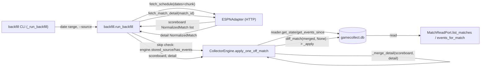
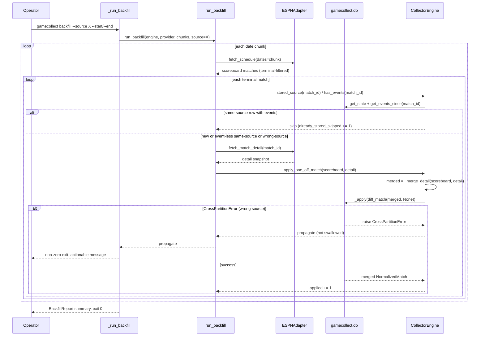

# Task: Historical/full-tournament backfill (prior-day matches)

**Status**: Not Started
**Component**: collector
**Assigned to**: Claude
**Priority**: High
**Branch**: feature/gameworker-integration (existing — lands on PR #5, no new branch)
**Created**: 2026-07-18

## Objective

Add a one-shot `backfill` CLI path that ingests **completed matches from prior
days** — games that have already rolled off ESPN's current-day scoreboard and
are therefore invisible to the live daemon and its same-day finished-match
backfill — by enumerating them via `fetch_schedule(dates=...)` and writing
them through the collector's existing write path. Closes the Follow-up Work
gap explicitly deferred by `docs/dev_plans/20260711-feature-finished-match-backfill.md`
("Prior-day finished-match backfill (out of scope here)").

## Context

The live daemon (`CollectorEngine.poll_once`) only ever sees matches on
ESPN's *current-day* scoreboard: `fetch_live_matches()` for in-progress
games, plus a same-day "first sight already finished" backfill
(`_first_sight_finished`, `src/gamecollect/engine.py:545-577`, added by the
sibling plan above) for a match that finished earlier the same slate-day and
is therefore still present in the default (no-`dates`) scoreboard response.
Neither path ever queries a **prior** day's scoreboard, so a match that
finished yesterday or earlier has permanently rolled off the board and is
never written — the gamealerts GameWorker (reading via `MatchReadPort`,
`docs/integration/gameworker-contract.md`) has no data for it, ever.

This is a design ceiling, not an API limit: `src/gamecollect_football/espn.py:824-837`'s
`fetch_schedule(*, dates: str | None = None)` already exists, hits the same
`fifa.world` scoreboard endpoint with an explicit `?dates=YYYYMMDD` or
`YYYYMMDD-YYYYMMDD` range, and has **zero callers today**. The sibling plan's
Findings already live-verified (2026-07-12) that a match finished the prior
slate (`760511`) is present under `dates=20260710` but absent from the
default scoreboard response
(`docs/dev_plans/20260711-feature-finished-match-backfill.md:48,223`) — the
data is reachable, this is wiring, not new ingestion logic.

**Depends on / reuses:** PR #5's `feature/gameworker-integration` branch —
this work lands directly on it (not a new branch) because it exercises the
exact same write path (`CollectorEngine._apply` → `seed_match` →
`append_events` → `persist_side_tables`) and the `MatchReadPort`/`list_matches`
contract PR #5 introduces is what makes backfilled data actually reachable by
gamealerts. PR #5 is being held open deliberately for integration gaps like
this one.

**Known downstream effect — gamealerts side, not fixed here (addendum from
the gamealerts session, 2026-07-18; flagged as an unverifiable sibling-repo
claim by `/review-plan` 2026-07-19, assumptions lens, Important):** the
gamealerts session reports that once the full tournament is backfilled,
most teams will have multiple finished matches in the DB, and that
gamealerts' team-name resolver (`resolve_team_by_name`) treats "one team
name matching more than one candidate match" as Layer-2 ambiguity and
returns `None`, so a single-team query like "who scored in the Argentina
game" would be refused once Argentina has 2+ finished matches — reportedly
the resolver working correctly (safe-by-design), not backfilled data being
wrong, with two-team queries ("Argentina vs Brazil") unaffected. **This is
an assumption about sibling-repo behavior, not something this repo can
verify**: `rg resolve_team_by_name` in this repo hits only docs, never
code, and `docs/integration/gameworker-contract.md` §1 explicitly records
that no such port method was added — the resolver lives entirely in
gamealerts. Accordingly: **collector-side acceptance tests must
independently confirm the backfilled match's `participants`/canonical
names are correct via `list_matches`/`events_for_match` directly** (this
plan's own mechanism, not gamealerts'). Only after that collector-side data
is confirmed correct should a refused single-team query be treated as
gamealerts' resolver behaving as reported, rather than assumed without
checking; any UX fix for the refusal itself is a later gamealerts product
decision, out of scope here.

## Requirements

- **No forked write path — including the scoreboard/detail merge step.**
  Every write goes through the exact same `CollectorEngine._apply(MatchDiff)`
  sequence the live daemon and the same-day finished-match backfill already
  use (`src/gamecollect/engine.py:894-945`: `pack.seed_match` →
  `writer.append_events` → `pack.persist_side_tables`). **Review-plan
  correction (`/review-plan` 2026-07-18, architecture lens, Critical):** the
  live/same-day backfill path never applies a raw `fetch_match_detail`
  snapshot directly — it always merges it over the enumerating scoreboard
  snapshot first (`merged = _merge_detail(match, detail)`,
  `src/gamecollect/engine.py:1527`). `_merge_detail`
  (`src/gamecollect/engine.py:275-316`) exists specifically so a detail
  endpoint omitting `kickoff_utc`/`home_team`/`away_team` doesn't wipe stored
  identity to NULL (or make `seed_match` return `None` and drop the poll's
  events), and so a detail omitting a score doesn't null a known scoreboard
  score. A new thin public wrapper,
  `CollectorEngine.apply_one_off_match(scoreboard: NormalizedMatch, detail:
  NormalizedMatch) -> NormalizedMatch | None`, must therefore take **both**
  snapshots — the scoreboard match `enumerate_finished_matches` yielded and
  the `fetch_match_detail` result — merge them via the same
  `_merge_detail(scoreboard, detail)`, build a from-scratch `MatchDiff` via
  `diff_match(merged, last=None)` (`src/gamecollect/diffing.py:80-94`,
  confirmed: `last=None` produces `state_changed=True` and `new_events=` the
  full sorted event list), and call `self._apply(diff)` — no new seed/write
  logic, no bypass of `seed_match`'s identity/reconcile behavior, and no
  divergence from the live path's snapshot shape.
- **Source tag must match the live daemon's source exactly — this is not a
  style choice, it is required by existing writer semantics.** Confirmed
  from `src/gamecollect/db/writer.py:154-188,407-431` and
  `src/gamecollect/db/schema.sql:37-38`: `matches.match_id` is the **sole**
  primary key (not composite with `source`); `upsert_match` does
  `INSERT ... ON CONFLICT (match_id) DO UPDATE ... WHERE matches.source =
  excluded.source`, and `_assert_match_owned` raises `CrossPartitionError`
  proactively if a match row already exists under a **different** source.
  A backfill run using a distinct `--source` (e.g. `wc2026-backfill`) would
  therefore **hard-fail**, not duplicate, the moment a backfilled match is
  later (or was already) seen live under `wc2026-live` — there is no
  "dedup across sources" to design, because the writer already refuses
  cross-source writes to the same `match_id`. The CLI's `--source` for
  `backfill` must be documented as "must equal the live daemon's `--source`
  for this data to ever merge with live-seen matches," not left as an
  independent free-text flag.
  - `events` table, by contrast, has a composite PK `(source, match_id,
    seq)` (`schema.sql:77`) — event rows DO partition per-source. This is
    consistent with same-source backfill being the only viable option: it
    guarantees both `matches` and `events` land under one partition.
  - **Review-plan correction (`/review-plan` 2026-07-18, spec-and-testing
    lens, Important):** help text alone is not sufficient mitigation — the
    Review Focus explicitly names the failure mode as "a confusing
    `CrossPartitionError` deep in the writer, not a clear upfront CLI
    error." `_run_backfill` MUST catch `CrossPartitionError` around the
    `run_backfill` call and exit non-zero with an actionable message (which
    match id, which source it's actually owned by, and that `--source` must
    match) rather than letting the raw traceback surface. This is a CLI-level
    requirement, not just a documentation one.
  - **Review-plan correction (`/review-plan` 2026-07-19, architecture lens,
    Important):** `run_backfill`'s `source` parameter must not be able to
    diverge from the engine it's driving — `CollectorEngine` already owns
    `self._source`, and every write goes through `engine._writer` under
    that value. `CollectorEngine` gains a read-only `source` property;
    `run_backfill` reads `engine.source` for its skip-check comparisons
    instead of trusting a separately-passed kwarg to stay in sync (the
    `source` kwarg is kept for call-site clarity, but `run_backfill`
    asserts `source == engine.source` at entry and raises immediately on
    mismatch) — a caller passing a different value must fail loudly, not
    silently read one partition while writing to another.
- **Idempotent and resumable using existing writer behavior, not new
  dedup logic.** `PartitionWriter.append_events` is already idempotent via
  `INSERT OR IGNORE` keyed on `(source, match_id, seq)` with a full-row
  fingerprint check for re-sent seqs (`src/gamecollect/db/writer.py`
  docstring on `append_events`); `upsert_match` is idempotent per-source by
  construction (same `ON CONFLICT ... WHERE source` clause above). Re-running
  `backfill` over an already-ingested date range must not raise, duplicate,
  or corrupt state — it should be a safe no-op write per already-stored
  match. For efficiency (avoid re-fetching `fetch_match_detail` for matches
  already fully stored), the backfill loop should skip the detail fetch when
  a stored row already exists for that `match_id`.
  **Review-plan correction (`/review-plan` 2026-07-18, architecture +
  spec-and-testing lenses, both Important, related):** a bare
  `reader.get_state(conn, match_id)` existence check is **not** sufficient —
  two distinct defects:
  1. **Source-blindness**: `get_state` (`src/gamecollect/db/reader.py:125-128`)
     is `SELECT * FROM matches WHERE match_id = ?` with no `source`
     predicate, so it cannot distinguish a row stored under the *target*
     source (safe to skip) from one stored under a *different* source (the
     misconfigured-`--source` case, which must surface a clear error, not a
     silent skip that convinces the operator the match was backfilled). The
     skip logic must inspect the returned row's `source` column: skip only
     when `row["source"] == target_source`; when it differs, raise/record a
     clear typed error immediately rather than silently skipping or falling
     through to a `CrossPartitionError` deep in the writer.
  2. **Event-less-row blindness**: a match the live daemon already gave up
     backfilling (its bounded-retry-then-give-up path,
     `docs/dev_plans/20260711-feature-finished-match-backfill.md`) persists
     a scoreboard-only `matches` row with **zero events**. A bare existence
     check would skip such a match forever, silently violating this plan's
     own acceptance criterion that `events_for_match` answers "who scored"
     for every backfilled match. The skip condition must be "a row exists
     for this `match_id` under the target source **AND** it has at least one
     stored event," not bare row existence — a same-source, event-less row
     must still trigger a `fetch_match_detail` + `apply_one_off_match` retry.
  - **Review-plan correction (`/review-plan` 2026-07-19, architecture lens,
    Important):** the skip check's read handle was unspecified —
    `reader.get_state`/`reader.get_events_since` both require a
    `sqlite3.Connection`, and `run_backfill`'s only handle is `engine`,
    whose connection is private (`engine._conn`). `CollectorEngine` gains
    two thin read accessors, `stored_source(match_id) -> str | None` and
    `has_events(match_id) -> bool`, so `backfill.py` never reaches into
    `engine._conn` — this is the seam recorded in the Integration Seams
    table below.
  - **Review-plan correction (`/review-plan` 2026-07-19, spec-and-testing
    lens, Important):** the skip predicate ("same-source row AND ≥1 stored
    event") treats any row with at least one event as fully hydrated. A row
    with *some but not all* events (e.g. ESPN's detail endpoint
    under-reported events on first fetch) satisfies this and is skipped
    forever — an accepted coverage limitation, not a bug: `backfill` never
    re-hydrates a partially-stored match, only a zero-event one. State this
    explicitly in `docs/integration/gameworker-contract.md` (Phase 5)
    alongside the other coverage-ceiling caveats.
- **Date-range chunking: day-by-day only, not a week-sized batch.**
  **Review-plan correction (`/review-plan` 2026-07-18, assumptions lens,
  Important):** the hyphenated `YYYYMMDD-YYYYMMDD` range form was never
  actually live-verified — every recorded probe (this plan's Phase 1 and the
  sibling plan's Findings) sends a **single** `dates=YYYYMMDD` value. Only
  single-day queries have confirmed behavior. `chunk_date_range` therefore
  chunks **strictly day-by-day** — every yielded chunk is one `YYYYMMDD`
  value, no week-sized-batch option; the range-syntax question is out of
  scope until it has its own live probe, not silently assumed to work at a
  wider granularity.
  - **Slate-vs-calendar-day rollover** (`/review-plan` 2026-07-18, assumptions
    lens, Minor): the sibling plan's own Findings established ESPN's
    scoreboard rollover is **slate-based, not calendar-midnight-based**
    (`docs/dev_plans/20260711-feature-finished-match-backfill.md:228`) — a
    slate can span past UTC midnight, so a match's containing `YYYYMMDD` key
    is not provably its calendar kickoff date. Because
    `PartitionWriter.append_events`/`upsert_match` are idempotent
    (Requirements above), day-by-day chunks generated with **1-day overlap
    on each side** of the requested window are safe (a match re-enumerated
    under an adjacent day's chunk is a no-op re-apply, not a duplicate) and
    are the conservative default rather than a bare non-overlapping
    calendar walk.
  - **Pagination/truncation risk on high-match-count days**
    (`/review-plan` 2026-07-18, assumptions lens, Important): every live
    probe to date covered slates with 1-2 events; whether a busy
    multi-match slate (e.g. an opening group-stage day) is paginated,
    capped, or silently truncated by ESPN is unverified, and
    `_default_http_get`'s `_MAX_RESPONSE_BYTES` 16MB cap
    (`src/gamecollect_football/espn.py:528,553-556`) raises
    `ProviderUnavailableError` on overflow rather than truncating silently
    — so a truncation surfaces as a hard failure for that chunk, but this
    must be verified against a real busy day, not assumed benign.
    **Corrected (`/review-plan` 2026-07-19, spec-and-testing lens,
    Important):** a chunk-level `fetch_schedule` failure happens before any
    match id exists, so it cannot be recorded in `BackfillReport.failed`
    (which is match-id-keyed) — the original wording claiming otherwise was
    wrong. `run_backfill` catches a `fetch_schedule` failure per chunk,
    records it in a new `BackfillReport.failed_chunks: list[tuple[str,
    Exception]]` field, and continues to the next chunk rather than
    aborting the whole date range on one bad chunk.
  - **ESPN rate-limit/burst behavior is unverified**
    (`/review-plan` 2026-07-18, assumptions lens, Important): the live
    daemon issues roughly one `fetch_match_detail` per poll interval;
    `run_backfill` issues potentially hundreds of back-to-back
    `fetch_schedule`/`fetch_match_detail` calls with no throttle —
    `_default_http_get` has no sleep/backoff/retry/429 handling
    (`espn.py:531-565`). Mitigation (accepted, not deferred): `run_backfill`
    sleeps a small fixed interval (e.g. 0.5s, injectable for tests) between
    HTTP-issuing calls as a conservative default; a request that still fails
    (throttled or otherwise) is collected into `BackfillReport.failed` for
    that match rather than aborting the run, and a subsequent `backfill`
    re-run recovers it via the idempotent skip-or-apply logic above — no
    dedicated retry-with-backoff is built in v1, the coarse "re-run the
    whole command" recovery path is the accepted design for now.
- **Endpoint-shape verification is a gated, explicit plan step, not an
  assumption carried forward.** `src/gamecollect_football/espn.py:12-17`'s
  module docstring already flags `fifa.world` endpoint shape/slug uniformity
  as unverified beyond ad hoc spot checks. The sibling plan verified
  `fetch_schedule`/`fetch_match_detail` against matches only a day or two
  old (`760511`/`760512`). This plan must probe against a match from
  **early in the tournament window** (materially older, not adjacent-day) —
  both `fetch_schedule(dates=<that day>)` and `fetch_match_detail(<that
  id>)` — with an explicit STOP-and-return-to-plan-update outcome if either
  fails, mirroring the sibling plan's own live-network gate structure
  (`docs/dev_plans/20260711-feature-finished-match-backfill.md` Phase 1).
  **Review-plan addition** (`/review-plan` 2026-07-18, assumptions lens,
  Minor): the probe must also record the raw ESPN `status.type` string for
  the older match, not just confirm it maps to `MatchStatus.FINISHED` —
  terminal-status mapping has so far only been live-verified for
  recent/standard outcomes; an older or non-standard outcome (abandoned,
  awarded) that maps to `UNKNOWN` instead would be silently excluded by the
  terminal filter, and that must be an observed, named outcome, not an
  invisible gap.
- **`fetch_schedule` stays ESPN-only; the generic `MatchDataProvider` ABC is
  NOT widened.** The sibling plan's Follow-up Work explicitly named widening
  the ABC as one option and left it undesigned
  (`docs/dev_plans/20260711-feature-finished-match-backfill.md:204`). This
  plan keeps that boundary: the backfill CLI path checks for
  `fetch_schedule`/`fetch_match_detail` via `hasattr` on whatever provider
  `pack.provider_factory()` yields (or an injected provider in tests) and
  fails with a clear CLI error — not an `AttributeError` — when the
  configured provider does not support historical enumeration (e.g.
  `ReplayProvider`, which has no `fetch_schedule` equivalent).
- **One-shot, not a poll loop.** The `backfill` subcommand runs enumeration
  + apply to completion and exits (code 0 on success, non-zero on the
  live-probe gate failure or a pack/provider load error) — it does not
  construct a `CollectorEngine.run()` loop and never calls `sleep`/blocks on
  SIGTERM.
- **Coverage ceiling documented, not implied.** Only matches ESPN's
  `fifa.world` scoreboard lists for the requested date range are reachable —
  there is no all-match-id schedule endpoint wired, and a match ESPN itself
  never listed (extremely unlikely for a modern tournament, but not
  provably impossible) would silently not appear. State this explicitly in
  `docs/integration/gameworker-contract.md`, not left implicit.
- **A backfill-only run (no live daemon ever started) must still stamp the
  shared file so gamealerts' read-only gate accepts it — verified, not
  assumed** (addendum from the gamealerts session, 2026-07-18: gamealerts
  reportedly opens the shared file read-only and gates on the collector's
  schema stamp via `wait_for_collector_file_stamped`, raising
  `CollectorNotReadyError` when absent — **these two symbol names are
  gamealerts-side, per the 2026-07-18 session, and not independently
  verifiable from this repo** (`/review-plan` 2026-07-19, assumptions lens,
  Minor); a DB that only ever went through `backfill` — the live poll loop
  never ran — must still pass that gate). **Confirmed already structurally
  satisfied**: `CollectorEngine.__init__`
  (`src/gamecollect/engine.py:674`) calls `connect(self._db_path,
  side_table_ddl=pack.side_table_ddl)` unconditionally at **construction**
  time, not lazily on first `poll_once`/`run()` — and `connect()` stamps
  `schema_meta` + creates `matches` as part of schema application
  regardless of what happens afterward (§2 of
  `docs/integration/gameworker-contract.md`, "Startup ordering"). Phase 3's
  `_run_backfill` already constructs the engine (`engine_factory(pack,
  args.db, args.source, ...)`) before calling `run_backfill`, so the stamp
  lands even on a zero-match backfill run. This requirement is therefore
  "confirm it holds, with a test" rather than "build it" — but it must be
  an explicit, tested contract, not an implicit side effect a future
  refactor could silently break (e.g. by making engine construction lazy).
  **Review-plan correction (`/review-plan` 2026-07-19, sequencing +
  spec-and-testing lenses, Important, merged):** the verifying test must
  actually exercise the guarantee as stated — through `_run_backfill`
  (Phase 3), which is where engine construction precedes `run_backfill`,
  not by constructing the engine directly in the test — and must pin a
  **zero-match** enumeration (so the stamp is provably coming from
  construction, not from a write) and open the verification connection
  **read-only**, so a future refactor making construction lazy or
  conditional would actually fail this test. `get_schema_version` is this
  repo's collector-side proxy for gamealerts' reported gate; the true
  cross-repo equivalence was verified live on the gamealerts side (see
  Findings, Tier-3 signal), not by this collector-side test.

## Review Focus

- **Source-tag requirement is a hard writer constraint, not a convention.**
  Verify the plan and its CLI help text make the "backfill `--source` must
  equal the live daemon's `--source`" requirement impossible to miss — a
  user who runs backfill with a different `--source` value gets a confusing
  `CrossPartitionError` deep in the writer, not a clear upfront CLI error.
  Consider whether `backfill` should validate/require this by checking
  against a recorded "known live source" convention, or whether a loud
  docstring/help-text is sufficient (this repo's convention leans toward
  explicit CLI flags over hidden config — confirm the final approach here
  doesn't invent implicit cross-source magic).
- **`apply_one_off_match`'s `MatchDiff` construction must exactly match
  `_first_sight_finished`'s FRESH-write semantics** (`last=None`) — not the
  running-diff semantics `poll_once` uses against an in-memory baseline.
  Verify no engine in-memory state (`self._transitions`, `self._backfill`
  trackers, `self._last_snapshots` or equivalent) is read or mutated by the
  new one-shot path — those are poll-loop-only state and must stay untouched
  by a one-shot backfill call so a later live-daemon run over the same
  matches is not confused by stale in-memory backfill state.
- **Idempotency claim must be demonstrated, not assumed**: a test must
  actually re-run backfill twice over the same fixture data and assert zero
  new rows / zero errors on the second run, not just cite `append_events`'s
  existing idempotency docstring.
- **No-duplicate-across-source claim must be demonstrated with a real
  `CrossPartitionError` assertion** if a wrong `--source` is used (proving
  the writer's existing guard actually fires end-to-end through this new
  path), not just asserted as a design property in prose.

## Implementation Checklist

### Phase 1: Live-network gate — endpoint verification beyond same-day matches

**Impl files:** (none — verification only, findings recorded in this plan)
**Test files:** (none)
**Test command:** `uv run python -c "..."` (ad hoc live probe script, output pasted into Findings)
**Goal:** Confirm `fetch_schedule`/`fetch_match_detail` return correctly-shaped data for a match materially older than the sibling plan's one-day-old spot check, before any implementation code is written against that assumption.

- Pick one completed WC2026 match from early in the tournament window
  (materially older than the sibling plan's `760511`/`760512` same-adjacent-day
  probe — a genuinely different part of the schedule).
- Run `ESPNAdapter().fetch_schedule(dates=<that day, YYYYMMDD>)` live; confirm
  the target match id appears with a terminal status. Record the raw ESPN
  `status.type` string verbatim, not just that it maps to
  `MatchStatus.FINISHED`.
- Run `ESPNAdapter().fetch_match_detail(<that id>)` live; confirm it returns
  `status=MatchStatus.FINISHED` (or another terminal status) with a non-empty,
  correctly-shaped event list (team/player/assist populated on at least one
  goal-family event, mirroring the sibling plan's verification depth).
- **New probes added (`/review-plan` 2026-07-18):**
  - Send one live `fetch_schedule(dates="<day1>-<day2>")` hyphenated range
    query (two adjacent days) and confirm it returns the union of both
    days' matches — the range form has never been sent by any prior probe;
    if it fails or returns only one day's data, day-by-day-only chunking
    (already the plan's default per the Requirements correction above) is
    confirmed as the only supported form, not just the conservative choice.
  - Probe `fetch_schedule(dates=<a known high-match-count day, e.g. an
    opening group-stage slate>)` and confirm the returned match count
    matches the real fixture list for that day (no silent pagination/cap).
- Record all raw outcomes in `## Findings` verbatim (ids, response shape
  highlights, raw status strings, match counts), not just "confirmed."
- **STOP condition**: if the single-day `fetch_schedule`/`fetch_match_detail`
  probes fail, error, or return a shape inconsistent with
  `assert_espn_summary_shape`'s expectations, return to `/dev-plan update`
  with the failure — do not proceed to Phase 2 on an unverified assumption.
  A range-query or high-count-day probe failure does NOT block Phase 2 (the
  plan already defaults to day-by-day chunking and treats truncation as a
  per-chunk `BackfillReport.failed` entry, not a hard stop) — record the
  failure in Findings and proceed.
- **Phase 1 has no impl files by design** (`/review-plan` 2026-07-18,
  sequencing lens, Minor): its only artifact is this plan's own `##
  Findings` section. Its "commit," if any, is a dev-plan doc update, not a
  code diff — a phase-runner expecting a code change per phase should treat
  this as an intentional doc-only phase, not a skipped one. The STOP
  condition above returns to `/dev-plan update`, it does not advance to
  Phase 2 with an unresolved gate.

### Phase 2: `CollectorEngine.apply_one_off_match` + backfill enumeration module

**Impl files:** `src/gamecollect/engine.py, src/gamecollect/backfill.py`
**Test files:** `tests/test_backfill.py`
**Test command:** `uv run pytest tests/test_backfill.py -v`
**Goal:** Enumeration and one-shot apply must be plain, independently testable functions built on the existing write path — no new persistence logic, no engine in-memory state touched.

- Add `CollectorEngine.apply_one_off_match(self, scoreboard: NormalizedMatch,
  detail: NormalizedMatch) -> NormalizedMatch | None` — thin wrapper:
  `merged = _merge_detail(scoreboard, detail)`, `diff = diff_match(merged,
  None)`, then `return self._apply(diff)` (**corrected signature/body per
  the Critical review-plan finding above** — takes both the enumerating
  scoreboard snapshot and the fetched detail snapshot, merges them exactly
  as the live path does, rather than applying a raw detail snapshot). No
  other engine state read/written.
- **Added (`/review-plan` 2026-07-19, architecture lens, Important):**
  `CollectorEngine` gains a read-only `source` property (returns
  `self._source`) and two thin read accessors, `stored_source(match_id: str)
  -> str | None` and `has_events(match_id: str) -> bool`, wrapping
  `reader.get_state`/`reader.get_events_since` against the engine's own
  connection — so `backfill.py` never reaches into `engine._conn` and
  `run_backfill`'s skip check always reads the same source the engine
  writes under.
- New `src/gamecollect/backfill.py`:
  - `chunk_date_range(start: date, end: date, *, overlap_days: int = 1) ->
    Iterator[str]` — pure function yielding **single-day** `YYYYMMDD` chunk
    strings only (no hyphenated-range chunks — corrected per the Requirements
    above), by default padding `overlap_days` on each side of `[start, end]`
    to absorb slate-vs-calendar-day rollover.
  - `enumerate_finished_matches(provider, date_chunks: Iterable[str]) ->
    Iterator[NormalizedMatch]` — calls `provider.fetch_schedule(dates=chunk)`
    per chunk, yields matches whose status is terminal via
    `gamecollect.fallback_merge.is_terminal` (**corrected import — not
    `gamecollect.provider._is_terminal`, which does not exist; this is what
    `engine.py` itself imports, aliased locally as `_is_terminal`**). Raises
    a clear, typed error (not `AttributeError`) if `provider` lacks
    `fetch_schedule`.
  - `run_backfill(engine: CollectorEngine, provider, date_chunks:
    Iterable[str], *, source: str, request_delay: float = 0.5) ->
    BackfillReport` — asserts `source == engine.source` at entry
    (**added per `/review-plan` 2026-07-19, architecture lens, Important**
    — `run_backfill` must not trust a separately-passed `source` to stay in
    sync with the engine it's driving; a mismatch raises immediately rather
    than silently reading one partition while writing another). For each
    date chunk, wraps `provider.fetch_schedule(dates=chunk)` in a
    try/except: a chunk-level failure is recorded in a new
    `BackfillReport.failed_chunks: list[tuple[str, Exception]]` field and
    enumeration continues to the next chunk (**added per `/review-plan`
    2026-07-19, spec-and-testing lens, Important** — a `fetch_schedule`
    failure happens before any match id exists, so it cannot be recorded in
    the match-id-keyed `failed` field). For each enumerated scoreboard
    match: skip only when `engine.stored_source(match_id) == source` **and**
    `engine.has_events(match_id)` is true (**corrected skip predicate** —
    see the Requirements correction above; both the source check and the
    events-non-empty check are required, via the engine's read accessors
    rather than a bare existence check); a same-source stored row that
    exists but has zero events is NOT skipped. Otherwise sleeps
    `request_delay` seconds (rate-limit mitigation, see Requirements),
    calls `provider.fetch_match_detail(match_id)`, then
    `engine.apply_one_off_match(scoreboard, detail)`. `BackfillReport` is a
    small frozen dataclass: counts of `enumerated`, `already_stored_skipped`,
    `applied`, `failed` (with failed match ids + exceptions collected, not
    raised mid-loop — one bad match must not abort the whole window),
    `failed_chunks` (added above), plus an explicit count for the
    `apply_one_off_match` `None`-return case (**corrected — added per Minor
    finding below**): a `None` return counts as `failed` (the match was NOT
    durably written with events — same treatment as any other apply
    failure, so a subsequent re-run retries it rather than silently
    treating it as done).
    **`CrossPartitionError` is the one exception `run_backfill` does NOT
    swallow into `failed`** (added to resolve a design gap surfaced by the
    Phase 3 CLI-error-handling correction below): a `CrossPartitionError`
    signals a **run-wide** misconfiguration (`--source` doesn't match the
    source that actually owns this match_id) rather than a transient
    single-match issue — under a wrong `--source`, every subsequent match
    would raise the same error, so swallowing it per-match would silently
    burn through the whole date range recording every match as a generic
    failure instead of telling the operator immediately what's wrong.
    `run_backfill` lets `CrossPartitionError` propagate; `_run_backfill`
    (Phase 3) is the single place that catches it and stops the run with an
    actionable message.
- Tests: `chunk_date_range` boundary cases — single day, multi-day, exact
  `overlap_days` boundary, **and explicitly `start > end` (empty iterator)
  and `start == end` (single chunk, plus overlap padding)**;
  `enumerate_finished_matches` against a fake provider returning a mix of
  terminal/non-terminal matches; `run_backfill` against a fake provider +
  fake `CollectorEngine`-shaped double, asserting skip/apply/failed counts,
  that a same-source event-less stored row is NOT skipped, that a
  different-source stored row is treated as a clear failure (not a silent
  skip), that a fake `fetch_match_detail` failure for one match doesn't
  stop enumeration of the rest, and that a fake `apply_one_off_match`
  returning `None` is counted under `failed`. **New test (per Important
  Testing Gap finding):** after `apply_one_off_match`, assert
  `engine._transitions == {}`, `engine._backfill == {}`, and
  `engine._backfill_apply_pending == set()` — the one-shot path must leave
  every poll-loop-only in-memory container untouched. **New test
  (`/review-plan` 2026-07-19, spec-and-testing lens, Minor):** spy/patch
  `diff_match` inside `apply_one_off_match` and assert it is called with
  `last=None` specifically (FRESH-write semantics, not a running diff
  against stored state) — the existing isolation and merge-path tests
  prove adjacent properties but neither pins this directly. **New test
  (`/review-plan` 2026-07-19, spec-and-testing lens, Important):**
  `run_backfill` against a fake provider whose `fetch_schedule` raises on
  one chunk, asserting the exception is recorded in
  `BackfillReport.failed_chunks` and enumeration continues to the next
  chunk rather than aborting the run. **New test (`/review-plan`
  2026-07-19, architecture lens, Important):** `run_backfill` called with a
  `source` that does not match `engine.source` raises immediately, before
  any enumeration or fetch happens.

### Phase 3: CLI wiring — `backfill` subcommand

**Impl files:** `src/gamecollect/cli.py`
**Test files:** `tests/test_cli.py`
**Test command:** `uv run pytest tests/test_cli.py -v -k backfill`
**Goal:** Match the existing `collect` subcommand's injection-seam pattern exactly (`provider`/`engine_factory`/`pack_loader` overrides) so tests never hit real ESPN or real time.

- New subparser `backfill` (mirroring `collect`'s wiring,
  `src/gamecollect/cli.py:224-247`): `--pack` (required), `--db` (required),
  `--source` (required, with help text stating the cross-source constraint
  from Requirements), `--start-date`/`--end-date` (`YYYY-MM-DD`, both
  required) or a single `--dates START:END` flag — pick whichever reads
  cleaner against `chunk_date_range`'s signature, document the choice in
  Technical Specifications.
- `_run_backfill(args, *, provider=None, engine_factory=CollectorEngine,
  pack_loader=load_pack, loaded_packs=None) -> int` — mirrors `_run_collect`'s
  structure (`cli.py:315-349`) exactly: resolve pack via `loaded_packs`/
  `pack_loader`, resolve `provider` via the injection seam or
  `pack.provider_factory()`. **Corrected ordering (`/review-plan`
  2026-07-19, architecture lens, Minor):** check the provider's
  historical-enumeration capability (`hasattr(provider, "fetch_schedule")`
  **and** `hasattr(provider, "fetch_match_detail")`) and return the clear
  CLI error immediately if either is missing — **before** constructing the
  engine, so an unsupported-provider `backfill` invocation never
  creates/stamps a DB file it's about to fail out of. Only after that
  check passes: construct the engine, call
  `backfill.run_backfill(engine, provider, backfill.chunk_date_range(...),
  source=args.source)`, print a summary (`BackfillReport` counts),
  `engine.close()` in a `finally`, return 0 on success / non-zero on the
  capability-check failure. **Corrected (`/review-plan` 2026-07-18,
  spec-and-testing lens, Important):** also catches `CrossPartitionError`
  around the `run_backfill` call and returns non-zero with an actionable
  message (offending match id, the source that actually owns it, and that
  `--source` must match the live daemon's) rather than letting the raw
  writer traceback surface — this is the CLI-level enforcement of the
  cross-source constraint, not just help text.
- **Added (`/review-plan` 2026-07-18, sequencing lens, Important):** append
  `"backfill"` to `HAND_WIRED_COMMANDS` (`src/gamecollect/cli.py:52`) in the
  **same commit** as the subparser — `build_parser`'s pack-name collision
  guard and `test_cli_subcommand_names_helper_matches_built_parser`
  (`tests/test_cli.py:470-482`) both assert `declared == all_subparsers`
  where `declared = registry.names + HAND_WIRED_COMMANDS`; omitting this
  update breaks that test and misclassifies `backfill` as a registry read
  op in `_read_subparser_names`.
- `main()` dispatches `command == "backfill"` to `_run_backfill`, following
  the existing `command == "collect"` branch shape (`cli.py:392-399`).
  **Clarified (`/review-plan` 2026-07-19, sequencing lens, Minor):** the
  subparser, the `HAND_WIRED_COMMANDS` append, and this `main()` dispatch
  branch are all part of one atomic edit to `cli.py` — land all three in
  the same commit; the subparser or the tuple update alone leaves
  `backfill` either untested or dispatching nowhere.
- Tests: argparse wiring (required flags, help text mentions the
  cross-source constraint), `_run_backfill` with an injected fake provider
  + fake engine double verifying the report is printed and `engine.close()`
  is always called, the clear-error path when an injected provider lacks
  `fetch_schedule`, **a clear-error test when an injected provider has
  `fetch_schedule` but lacks `fetch_match_detail`** (`/review-plan`
  2026-07-19, spec-and-testing lens, Minor — the capability check now
  covers both methods per the reordering above, but only the
  `fetch_schedule`-absent case had a test), **and a test that a
  `CrossPartitionError` raised from `run_backfill` is caught and produces a
  non-zero exit with an actionable message, not a raw traceback**.

### Phase 4: Idempotency, dedup, and end-to-end fixture tests

**Impl files:** (test-only phase; no new impl files expected beyond any gaps Phase 2/3 review surfaces)
**Test files:** `tests/test_backfill.py, tests/test_backfill_integration.py`
**Test command:** `uv run pytest tests/test_backfill.py tests/test_backfill_integration.py -v`
**Goal:** Prove — don't assert in prose — idempotent re-run, cross-source rejection, and a real replay-fixture ingest through the full backfill path.

- **Replay-fixture ingest test**: using the existing
  `tests/football/_football_helpers.py`'s `replay_fixture`/`KNOCKOUT_FIXTURES`
  (`spain_portugal_760506.summary.json` et al.) as the `fetch_match_detail`
  stand-in for a fake provider, drive `run_backfill` end-to-end against a
  temp DB and assert: `matches`/`events`/`football_*` side tables are
  populated identically to how the existing `test_integration_shared_file.py`
  seeding recipe populates them (same scorer/lineup/venue assertions can be
  reused as a template), and that `MatchReadPort.list_matches()` and
  `events_for_match()` against the resulting DB return the backfilled match
  with correct participants/scorer (ties directly to this plan's Acceptance
  Criteria).
- **Re-run idempotency test**: run `run_backfill` twice over the same fake
  provider + date chunks against the same DB; assert the second run's
  `BackfillReport.applied == 0` (or equivalently, zero new event rows / no
  exceptions) and the stored data is byte-identical to after the first run.
  **Strengthened (`/review-plan` 2026-07-18, spec-and-testing lens,
  Important):** `applied == 0` alone doesn't prove the detail-fetch was
  actually *skipped* rather than re-fetched-and-no-op-applied — additionally
  assert the fake provider's `fetch_match_detail` call count is **zero** on
  the second run (all matches already stored, with events, under the
  correct source), and that `BackfillReport.already_stored_skipped ==
  BackfillReport.enumerated`.
- **Merge-path test (new, per the Critical review-plan finding):** seed a
  match's scoreboard snapshot with an identity field (`home_team`) that the
  fake detail response omits (`None`); call `engine.apply_one_off_match(
  scoreboard, detail)` and assert the stored row's payload still carries the
  scoreboard's `home_team` — proving the merge actually ran and prevented
  identity loss, not just that some row got written.
- **Cross-source rejection test**: backfill a match under source `X`
  (via `run_backfill` or a direct `apply_one_off_match` call), then attempt
  to apply the *same* match id's scoreboard+detail pair under a different
  source `Y` via `engine.apply_one_off_match(scoreboard, detail)`
  (simulating a misconfigured `--source`); assert `CrossPartitionError` is
  actually raised (not swallowed) — proving the "no dedup logic needed, the
  writer already refuses this" Requirements claim end-to-end. **Also add
  (per the run_backfill/CLI correction above):** a `run_backfill`-level
  test asserting the same `CrossPartitionError` propagates OUT of
  `run_backfill` uncaught (not swallowed into `BackfillReport.failed`), and
  a `_run_backfill` CLI-level test (Phase 3) that this propagated error is
  caught there and produces a clear non-zero exit.
- **Different-source existing-row test (new, per the source-blindness
  finding):** seed a match under source `X`; run `backfill` with
  `--source Y`/`source="Y"` targeting the same match id; assert the skip
  check does NOT silently skip it (the row exists but under the wrong
  source) — it must surface as the `CrossPartitionError` path above, not a
  silent `already_stored_skipped` count.
- **Event-less stored-row test (new, per the event-less-row-blindness
  finding):** seed a match under the target source with a `matches` row but
  **zero** stored events (simulating the live daemon's give-up path); run
  `backfill` over a window covering that match id; assert it is NOT skipped
  — `fetch_match_detail` is called and the match is hydrated with events on
  this run.
- **Backfill-then-live no-duplicate test**: backfill a match under source
  `wc2026-live` (or whatever fixture source is used), then feed the *same*
  match id through the normal `CollectorEngine.poll_once`/`_apply` path
  under the same source (simulating the daemon later seeing it "live" —
  even though by definition a backfilled match is already terminal, the
  test should simulate the daemon's own same-day finished-match backfill
  detecting no stored row is FALSE and skipping re-fetch, or if the daemon's
  restart sees it fresh, confirm `_apply`'s upsert is a clean update, not a
  duplicate row) — assert exactly one `matches` row for that match id
  afterward.
- Run `scripts/smoke_gameworker_contract.py` manually (not part of pytest)
  and confirm it is still 14/14 unaffected by these changes (it seeds its
  own fixture independently of backfill).
- **Backfill-only readiness-stamp test (new, per the gamealerts addendum,
  2026-07-18; corrected per `/review-plan` 2026-07-19, sequencing +
  spec-and-testing lenses, Important):** drive this through `_run_backfill`
  (Phase 3's CLI handler, not a directly-constructed engine) against a
  brand-new temp DB path, with the injected fake provider enumerating
  **zero** terminal matches for the requested range — `CollectorEngine
  .run()`/`poll_once()` are never called, and neither is any match apply.
  Then open a **fresh, separate, read-only** connection (`sqlite3.connect`
  with `mode=ro`, mirroring gamealerts' reported read-only open, and
  `TestStartupOrdering` in `tests/test_integration_shared_file.py`) and
  assert `get_schema_version(conn) is not None` and `matches` exists. This
  proves the stamp comes from engine **construction**, not from a write —
  a zero-match run has no writes to hide behind — and a future refactor
  making construction lazy would fail this test. Note: `get_schema_version`
  is this repo's collector-side proxy for gamealerts' reported
  `wait_for_collector_file_stamped` gate — those two symbol names are
  gamealerts-side per the 2026-07-18 session and not independently
  verifiable from this repo; the true cross-repo equivalence was verified
  live on the gamealerts side (see Findings, Tier-3 signal), not by this
  test.

### Phase 5: Docs

**Impl files:** `docs/integration/gameworker-contract.md, README.md`
**Test files:** (none)
**Test command:** (none — doc-only phase)
**Goal:** The coverage ceiling and cross-source constraint must be discoverable by a future reader without re-deriving them from code.

- `docs/integration/gameworker-contract.md`: new subsection (§6 or appended
  to an existing relevant section) documenting: the `backfill` CLI
  subcommand's existence and purpose, the **coverage ceiling** (only what
  `fifa.world`'s scoreboard lists for the requested dates is reachable — no
  all-match-id endpoint), and the **cross-source requirement** (`--source`
  must match the live daemon's source; a mismatch is caught and surfaced as
  a clear CLI error, not left to a raw `CrossPartitionError`). **Added
  (`/review-plan` 2026-07-18):** also document the day-by-day-only chunking
  decision (no verified week-sized-batch range query), the unverified
  pagination/rate-limit posture (a busy day or throttled run degrades to
  per-match `BackfillReport.failed` entries or per-chunk
  `BackfillReport.failed_chunks` entries recoverable by re-running, not a
  hard failure), and that a same-source stored row with zero events (a
  prior live-daemon give-up) is treated as not-yet-backfilled and retried,
  not skipped. **Added (`/review-plan` 2026-07-19):** also document that a
  same-source row with **some but not all** events is treated as complete
  and is NOT retried — an accepted coverage limitation, distinct from the
  zero-event case above (spec-and-testing lens, Important).
- `README.md`: add the `backfill` command to the CLI usage section
  alongside `collect`, if such a section exists (confirm during
  implementation; Explore did not check this file).

## Technical Specifications

### Files to Modify
- `src/gamecollect/engine.py` — add `CollectorEngine.apply_one_off_match(
  scoreboard, detail)` (thin wrapper over the existing `_merge_detail`/
  `_apply`/`diff_match` machinery — corrected to a two-arg form per the
  Critical review-plan finding); add a read-only `source` property and the
  `stored_source(match_id)`/`has_events(match_id)` read accessors
  (`/review-plan` 2026-07-19, architecture lens).
- `src/gamecollect/cli.py` — new `backfill` subparser + `_run_backfill`
  (including the `CrossPartitionError` catch), dispatched from `main()`;
  **`"backfill"` appended to `HAND_WIRED_COMMANDS`** in the same commit
  (per the sequencing review-plan finding).
- `docs/integration/gameworker-contract.md` — new documentation subsection.
- `README.md` — CLI usage addition (confirm section exists first).

### New Files to Create
- `src/gamecollect/backfill.py` — `chunk_date_range`,
  `enumerate_finished_matches`, `run_backfill`, `BackfillReport`.
- `tests/test_backfill.py` — unit tests for the functions above, including
  the corrected skip predicate, in-memory-state isolation, and
  `CrossPartitionError` propagation.
- `tests/test_backfill_integration.py` — replay-fixture end-to-end,
  idempotency, merge-path, and cross-source tests.

### Architecture Decisions
- **Reuse `CollectorEngine._apply` (via `_merge_detail` + a thin wrapper)
  rather than reimplementing seed/write/persist.** Rejected alternative: a
  standalone backfill writer function duplicating `seed_match`/
  `append_events`/`persist_side_tables`/`_merge_detail` sequencing —
  rejected per the explicit "do not fork the write path" requirement and
  because it would double-maintain the `SequenceError` reconciliation,
  pack-hook-failure handling, and merge semantics `_apply`/`_merge_detail`
  already carry. **Corrected (`/review-plan` 2026-07-18, architecture lens,
  Critical):** the wrapper takes both the scoreboard and detail snapshots
  and merges them — applying a raw, unmerged detail snapshot was the
  original (wrong) design.
- **No dedup table/logic; rely on existing per-source writer constraints —
  except `CrossPartitionError` is deliberately NOT swallowed into
  `BackfillReport.failed`.** Rejected alternative: a distinct
  `wc2026-backfill` source with an explicit merge/dedup step reconciling it
  against `wc2026-live` later — rejected because it would require new merge
  logic the writer's existing single-source-per-match_id constraint makes
  unnecessary, and because it would leave a window where `list_matches()`
  (read unfiltered by gamealerts) returns the same match twice under two
  sources. **Added (`/review-plan` 2026-07-18, spec-and-testing lens,
  Important):** unlike an ordinary per-match fetch/apply failure,
  `CrossPartitionError` signals a run-wide `--source` misconfiguration (every
  subsequent match would raise it too), so `run_backfill` lets it propagate
  uncaught rather than recording it as one more `failed` entry;
  `_run_backfill` is the single catcher, surfacing a clear non-zero exit
  instead of a raw traceback or a silently-all-failed run.
- **`fetch_schedule`/`fetch_match_detail` accessed via `hasattr` duck-typing
  on the injected/factory-produced provider, not a new `MatchDataProvider`
  ABC method.** Matches the sibling plan's explicit decision to leave the
  ABC unwidened (Follow-up Work); revisit only if a second provider needs
  historical enumeration.
- **`run_backfill` reads source/read-state through the engine, never
  through a raw connection or an independent kwarg it trusts blindly**
  (`/review-plan` 2026-07-19, architecture lens, Important). Rejected
  alternative: `backfill.py` opening its own `reader.connect(...)` handle
  and comparing against a bare `source: str` parameter — rejected because
  it couples `backfill.py` to `reader`/connection internals and creates a
  divergence risk (`source` param vs. `engine._source`) with no structural
  guard. `CollectorEngine` instead exposes a read-only `source` property
  and two accessors (`stored_source`, `has_events`); `run_backfill` asserts
  `source == engine.source` at entry so a mismatch fails loudly rather than
  silently reading one partition while writing another.

### Dependencies
- None — no new third-party dependencies (`pyproject.toml` has zero runtime
  `dependencies` today; `requires-python = ">=3.11"`, `pytest>=8.0`/`ruff>=0.4`
  dev-only).

### Integration Seams

| Seam | Writer (task) | Caller (task) | Contract |
|------|---------------|----------------|----------|
| `CollectorEngine.apply_one_off_match` | Phase 2 | Phase 2's `run_backfill`, Phase 4 tests | Takes `(scoreboard, detail)`, merges via `_merge_detail` before applying; must produce identical stored state to the live/same-day path; must not touch poll-loop-only in-memory state |
| `backfill.run_backfill` | Phase 2 | Phase 3's `_run_backfill` CLI handler | Must never raise mid-loop on a single match's ordinary fetch/apply failure — collects into `BackfillReport.failed` instead. **Exception: `CrossPartitionError` propagates uncaught** (a run-wide `--source` misconfiguration, not a per-match issue) — `_run_backfill` is the sole catcher |
| `--source` CLI flag | Phase 3 | Operator (documented contract) | Must equal the live daemon's `--source` value; a mismatch raises `CrossPartitionError` from `run_backfill`, caught by `_run_backfill` and surfaced as a clear non-zero exit with an actionable message (Requirements) |
| `CollectorEngine.stored_source`/`has_events` | Phase 2 | Phase 2's `run_backfill` skip check | Read accessors wrapping `reader.get_state`/`get_events_since` against the engine's own connection; `backfill.py` must not reach into `engine._conn` directly (**added `/review-plan` 2026-07-19, architecture lens, Important**) |

**Phase dependency note** (`/review-plan` 2026-07-18, sequencing lens,
Minor): Phase 4's tests drive `run_backfill`/`apply_one_off_match`/
`poll_once` directly — all defined in Phase 2 — and import no CLI code from
Phase 3. The real dependency graph is `2 → 3` and `2 → 4` in parallel, not
`2 → 3 → 4`; Phase 4 can proceed even if Phase 3 is still in flight.
**Added (`/review-plan` 2026-07-19, sequencing lens, Minor):** if Phase 4's
tests surface a Phase 2 defect while Phase 3 is concurrently building CLI
wiring on top of Phase 2, land the fix on Phase 2's surface first and have
Phase 3 rebase onto it — a parallel conductor must not let the two phases
fork divergent versions of `backfill.py`.

## Architecture & Call Flow

**Added (`/review-plan` 2026-07-18, architecture lens, Important/Missing
Task):** this plan wires 4+ independently-executing components (CLI, ESPN
HTTP provider, engine write path, SQLite store read back via `MatchReadPort`)
— the section was missing from the original draft and its absence is what
let the scoreboard/detail merge omission (the Critical finding) go
unnoticed. Tracing one match end-to-end below makes every snapshot
transition explicit.

| Step | Trigger | Enters context | Cleared/persisted | Turn boundary |
|------|---------|-----------------|---------------------|----------------|
| 1 | Operator runs `gamecollect backfill` | CLI args (`--source`, date range) | Persists as `_run_backfill`'s local `args` | Process start |
| 2 | `run_backfill` per date chunk | One chunk's scoreboard matches from `fetch_schedule` | Not persisted — iterated, discarded after enumeration | Per chunk |
| 3 | Per enumerated match, skip check | Stored row (if any) + event count from `db` | Not persisted — read-only check | Per match |
| 4 | Non-skipped match | Detail snapshot from `fetch_match_detail` | Merged with scoreboard, then persisted via `_apply` | Per match |
| 5 | `_apply` write succeeds/fails | Write result or exception | `matches`/`events`/side tables persisted on success; ordinary failures recorded in `BackfillReport.failed` (in-memory only, printed in the final summary); `CrossPartitionError` propagates and ends the run | Per match (success/ordinary-failure) or end-of-run (`CrossPartitionError`) |
| 6 | Run completes or aborts | `BackfillReport` counts | Printed to stdout; not itself persisted to the DB | Process exit |

## Testing Notes

### Test Approach
- [ ] Unit tests for `chunk_date_range`/`enumerate_finished_matches` (Phase 2)
- [ ] Unit tests for `run_backfill`'s skip/apply/failure-collection behavior,
      including the source-check + events-non-empty skip predicate and the
      `apply_one_off_match` `None`-return → `failed` accounting (Phase 2)
- [ ] Test that `apply_one_off_match`/`run_backfill` leave
      `engine._transitions`/`engine._backfill`/`engine._backfill_apply_pending`
      untouched (Phase 2)
- [ ] Merge-path test: a scoreboard identity field omitted by the detail
      snapshot survives via `_merge_detail` (Phase 4)
- [ ] CLI argparse + injection-seam tests for `backfill`, including the
      `HAND_WIRED_COMMANDS` update and the `CrossPartitionError`
      catch → non-zero-exit-with-message path (Phase 3)
- [ ] Replay-fixture end-to-end ingest test (Phase 4)
- [ ] Idempotent re-run test, including a `fetch_match_detail` zero-call-count
      assertion on the second run (Phase 4)
- [ ] Cross-source rejection test: `CrossPartitionError` raised by
      `apply_one_off_match`, propagated (not swallowed) by `run_backfill`,
      and caught by `_run_backfill` (Phase 4 + Phase 3)
- [ ] Different-source existing-row test: a stored row under the wrong
      source is never silently skipped (Phase 4)
- [ ] Event-less stored-row test: a same-source row with zero events is
      retried, not skipped (Phase 4)
- [ ] Manual `scripts/smoke_gameworker_contract.py` run, still 14/14 (Phase 4)
- [ ] Manual Phase 1 live probes: single-day, hyphenated-range, and
      high-match-count-day `fetch_schedule` queries; raw status string
      recorded for the older probe match
- [ ] Backfill-only readiness-stamp test: a DB touched only by `backfill`
      via `_run_backfill` (never `run()`/`poll_once()`), enumerating zero
      matches, is readable via a fresh **read-only** connection with
      `schema_meta` stamped (Phase 4, gamealerts addendum; corrected
      `/review-plan` 2026-07-19)
- [ ] `run_backfill` rejects a `source` argument that doesn't match
      `engine.source`, before any enumeration or fetch (Phase 2,
      `/review-plan` 2026-07-19, architecture lens)
- [ ] Chunk-level `fetch_schedule` failure is recorded in
      `BackfillReport.failed_chunks` and enumeration continues to the next
      chunk (Phase 2, `/review-plan` 2026-07-19, spec-and-testing lens)
- [ ] `apply_one_off_match`'s diff is built with `diff_match(merged,
      last=None)` specifically, not a running diff (Phase 2, `/review-plan`
      2026-07-19, spec-and-testing lens)
- [ ] Provider missing only `fetch_match_detail` (has `fetch_schedule`) —
      clear CLI error, not a mid-loop `AttributeError` (Phase 3,
      `/review-plan` 2026-07-19, spec-and-testing lens)

### Test Results
- [ ] All existing tests pass
- [ ] New tests added and passing
- [ ] Manual verification complete

### Edge Cases Tested
- [ ] Empty date range / no matches found for a chunk
- [ ] `start > end` (empty `chunk_date_range` iterator) and `start == end`
      (single chunk plus overlap padding)
- [ ] A chunk containing only non-terminal (scheduled/live) matches — none enumerated
- [ ] `fetch_match_detail` failure for one match mid-window — rest of window still processed
- [ ] Re-run over a fully-already-stored range — zero new writes, zero
      `fetch_match_detail` calls
- [ ] Provider without `fetch_schedule` (e.g. `ReplayProvider`) — clear error, not a crash
- [ ] Same-source stored row with zero events — retried, not skipped
- [ ] Stored row under a different source — surfaces as a caught
      `CrossPartitionError`, not a silent skip or a raw traceback
- [ ] `apply_one_off_match` returning `None` — counted as `failed`, not
      silently dropped
- [ ] A partially-hydrated same-source row (≥1 but not all events) — an
      accepted, documented coverage limitation: NOT retried (`/review-plan`
      2026-07-19, spec-and-testing lens)
- [ ] `fetch_schedule` failure on one date chunk — recorded in
      `failed_chunks`, remaining chunks still processed
- [ ] Provider with `fetch_schedule` but missing `fetch_match_detail` —
      clear error before any enumeration proceeds

## Acceptance Criteria

- After running `backfill` over the `KNOCKOUT_FIXTURES` replay set,
  `MatchReadPort.list_matches()` returns every backfilled match with
  correct `participants` (canonical names) and `events_for_match()`
  correctly answers "who scored" for each — verified by the Phase 4
  replay-fixture ingest test (**reworded per the spec-and-testing Minor
  finding**: the original "over the WC window"/"all completed matches"
  phrasing implied an unbounded live full-tournament run the test suite
  cannot check in CI; the Phase 1 live probes remain the manual/live
  confirmation that the mechanism works against real ESPN data, distinct
  from this CI-checkable criterion).
- `scripts/smoke_gameworker_contract.py` still 14/14 after this work lands.
- A match backfilled and then later encountered by the live daemon under the
  same `--source` does not produce a duplicate `matches` row (Phase 4 test).
- A same-source stored row with zero events (e.g. a prior give-up) is NOT
  skipped by a `backfill` re-run — it is hydrated with events (Phase 4
  event-less-stored-row test, per the event-less-row-blindness finding).
- A stored row under a *different* source is never silently skipped — it
  surfaces as a caught `CrossPartitionError` with an actionable CLI message,
  never a raw traceback (Phase 3 + Phase 4 tests, per the source-blindness
  and CLI-error-handling findings).
- `apply_one_off_match` merges the scoreboard and detail snapshots via
  `_merge_detail` before applying — proven by the Phase 4 merge-path test,
  not just asserted in prose (per the Critical finding).
- A DB touched only by `backfill` through `_run_backfill`, with zero
  matches enumerated (the live poll loop never started, and no match was
  applied), is stamped and readable by a fresh **read-only** connection
  with no `SchemaVersionError`/unstamped-`schema_meta` condition — the
  collector-side proxy for gamealerts' reported
  `wait_for_collector_file_stamped` gate passing against a backfill-only
  file (Phase 4 test, gamealerts addendum 2026-07-18; corrected
  `/review-plan` 2026-07-19 to require the CLI path + zero-match
  enumeration + read-only verification).
- `run_backfill` rejects a `source` that doesn't match `engine.source`
  before any enumeration or fetch happens (Phase 2 test, `/review-plan`
  2026-07-19, architecture lens).
- A chunk-level `fetch_schedule` failure is recorded in
  `BackfillReport.failed_chunks` and does not abort enumeration of the
  remaining chunks (Phase 2 test, `/review-plan` 2026-07-19,
  spec-and-testing lens).
- Enumeration unit tests (Phase 2) and a replay-fixture ingest test (Phase 4)
  both pass.
- `docs/integration/gameworker-contract.md` documents the backfill
  capability, the coverage ceiling (including the event-less-row,
  partially-hydrated-row, and pagination/rate-limit caveats), and the
  cross-source requirement.
- Full test suite green; `ruff check`/`ruff format --check` clean.
- Lands as commits on `feature/gameworker-integration` (PR #5) — no new
  branch/PR.

<!-- reviewed: 2026-07-19 @ fceca65e575ee6f93eea44d4f7b91bf0f3d1b3b0 -->

<!-- /review-plan writes the marker line above. Everything below is the workspace: edits here do NOT invalidate the marker. -->

## Progress

- [ ] Phase 1: Live-network gate — endpoint verification beyond same-day matches
- [ ] Phase 2: `CollectorEngine.apply_one_off_match` + backfill enumeration module
- [ ] Phase 3: CLI wiring — `backfill` subcommand
- [ ] Phase 4: Idempotency, dedup, and end-to-end fixture tests
- [ ] Phase 5: Docs

## Findings

- (append Phase 1's live-probe output here verbatim once run)

### Addendum from the gamealerts session (2026-07-18)

- **Source-tag dedup reinforced with external confirmation**: gamealerts
  confirmed from its own side (`main.py:1068`, `readport_shapes.py:346`)
  that it reads `list_matches()` **unfiltered by source**, so no
  gamealerts-side source-filtering is needed — the plan's existing
  "internal writer dedup only, no cross-source filter" design (Requirements,
  Architecture Decisions) is exactly the right scope; this is corroborating
  evidence for an already-made decision, not a new requirement.
- **Positive signal, no action needed**: gamealerts verified Tier-3 live
  wiring end-to-end this session against `feature/gameworker-integration`
  @ `7ebf35b` (editable-installed): the contract smoke script (14/14), a
  9/9 gamealerts-side read-path check, and the live shared-DB adapter +
  admission lock all resolved cleanly with no fallback path exercised. The
  `MatchReadPort`/`list_matches` contract (PR #5) holds against a real
  gamealerts integration — this plan's historical backfill is confirmed as
  the one remaining gap between "wired" and "actually answers about past
  games."

## Issues & Solutions

## Final Results

### Summary

### Outcomes

### Learnings

### Follow-up Work
